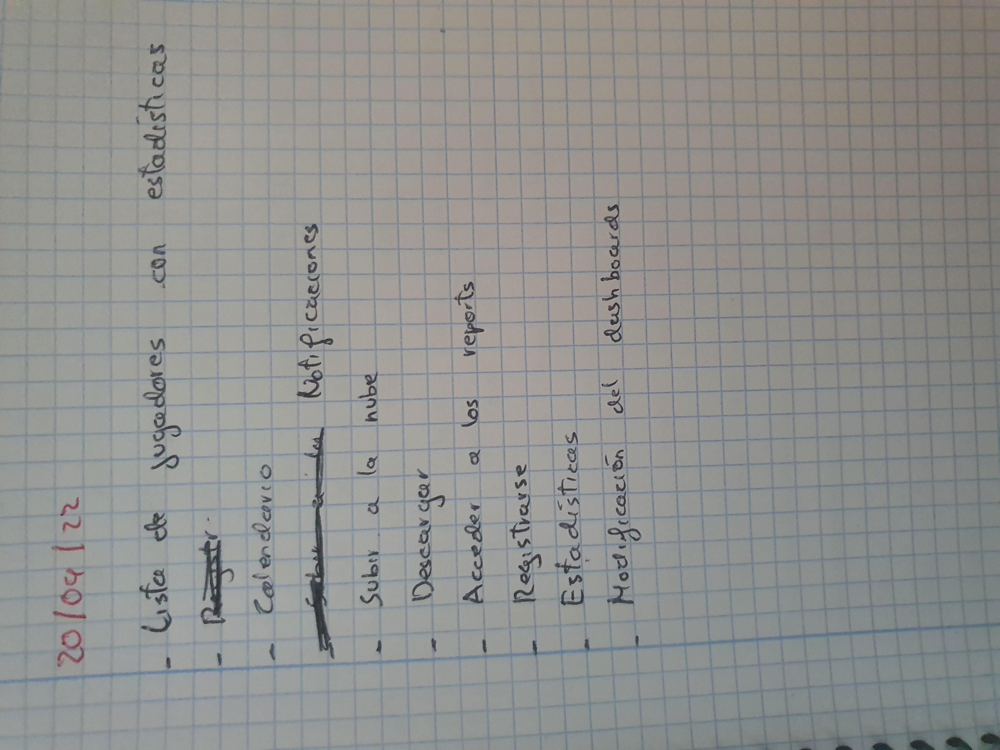
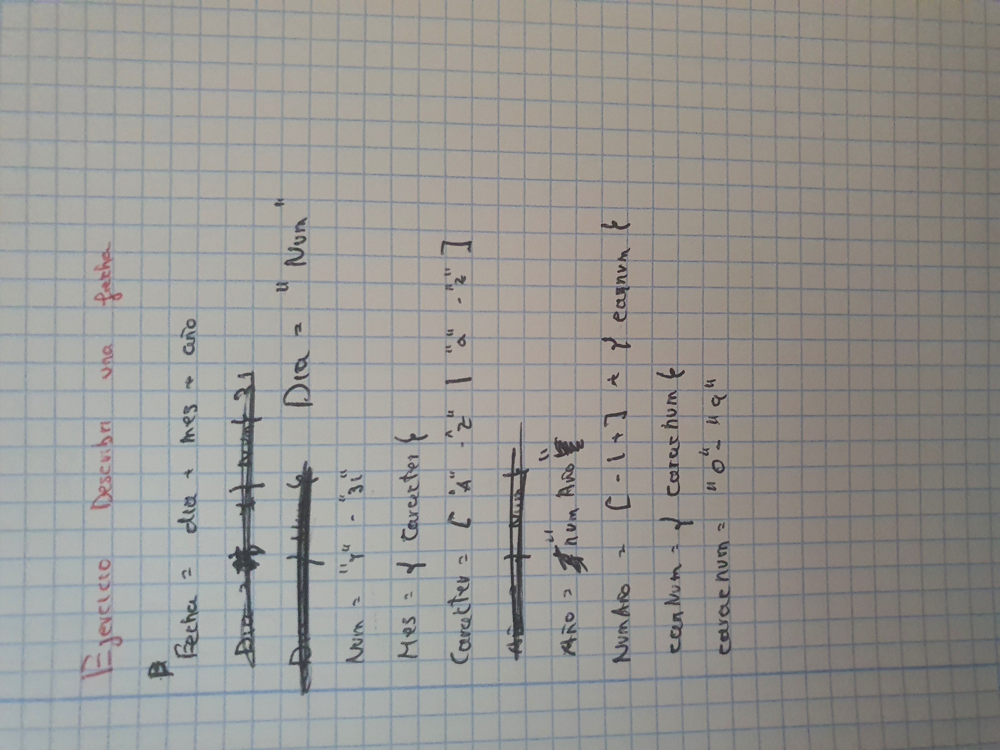
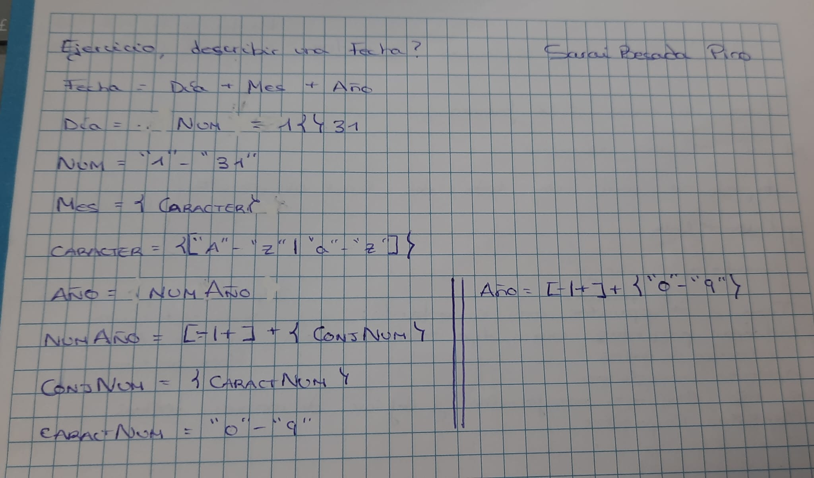
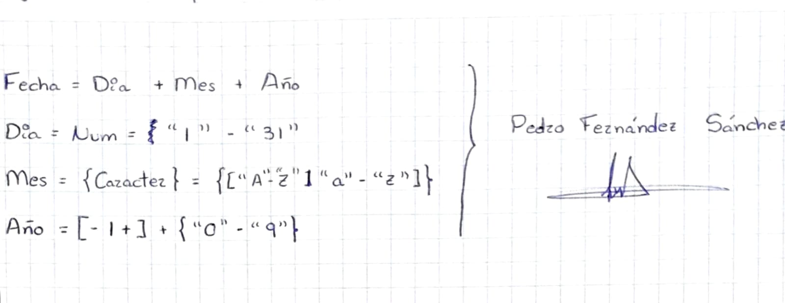
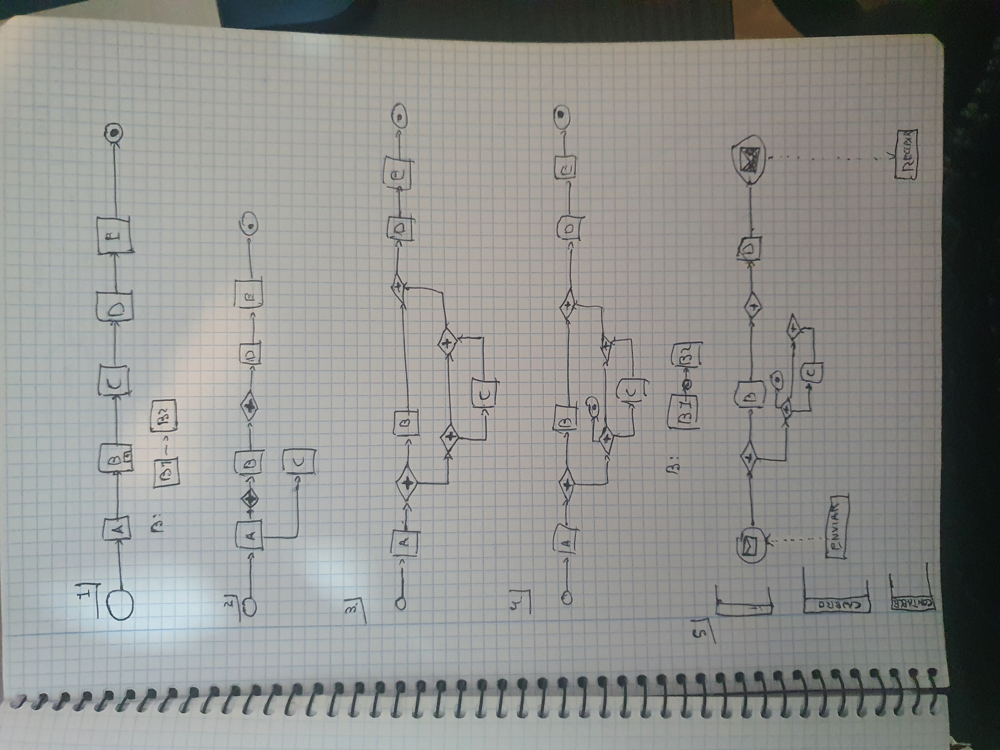

# Extras

# Casos de uso Actividad 0

# Describir Fecha Ayoub

# Describir Fecha Sarai

# Describir Fecha Cristian
Fecha  
Dia= Num  
Num= “1”-“31”  
Mes={Caracter}  
Carácter=[“A”-“Z” | “a”-“z”]  
Año=[- | +] + {CaracNum}  
CaracNum= “0”-“9”

# Describir Fecha Pedro

# Bpmn

