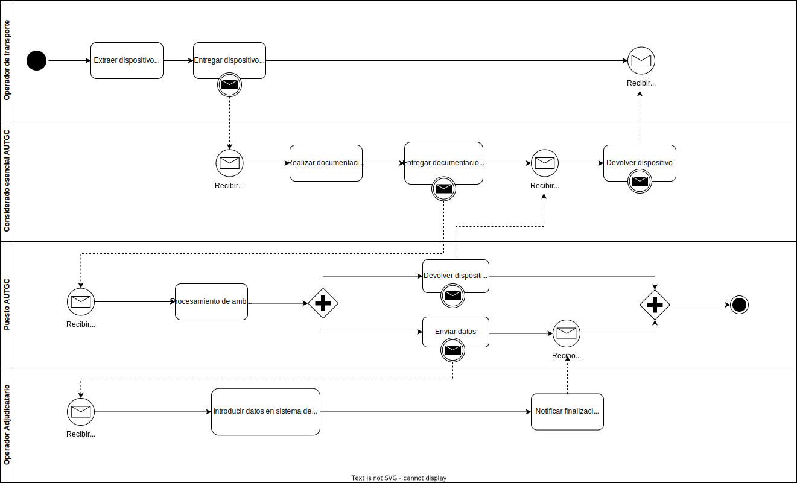

# Proyecto  

  

***Autores***:  
Ayoub Fehri Boulaadas  
Cristian Gil García.  
Pedro Sánchez Fernández.  
Sarai Besada Pino.  

## Hoja de revision

| ***Fecha*** | ***Version*** | ***Descripcion*** | ***Autor*** |
| ----------- | --- | --- | --- |
| 29/11/2022 | 1.0 | Proyecto para el desarrollo de un software de un sistema de informacion interactivo al viajero del transporte público regular de viajeros para la isla de Gran Canaria (Portal web de servicios) mediante procedimiento abierto | FehriGilFernandezBesada |  

 

## Introducción
En el siguiente documento se especifica los procesos llevados a cabo para el desarrollo de un proyecto software centrado en la implementación de un sistema de información y un portal web para una aplicación sobre el transporte público regular de viajeros para la isla de Gran Canaria.  
Además, se aporta información de la Autoridad de Transporte Público de Gran Canaria para facilitar el diseño del portal y sus funcionalidades.Por otra parte, se añaden los requisitos, diagramas, casos de uso e información necesaria para la implementación de todas las partes de la aplicación.

 

# Información del Dominio del problema.

## Organigrama
  

## Glosario de términos

| ***Fecha*** | ***Versión*** | ***Descripción*** | ***Autor*** |
| --- | --- | --- | --- |
| 29/11/2022 | 1.0 | Diccionario de palabras técnicas que permite disponer de toda la información que pueda crear dudas sobre el proyecto en orden alfabético.| FehriGilFernandezBesada |  

| ***Fecha*** | ***Versión*** | ***Término*** |***Descripción*** |***Autor*** |
| --- | --- | --- | --- | --- |
| 29/11/2022 | 1.0 | Alarma | Notificación acerca de los cortes en carreteras, colapso tras algún evento o el retraso de un transporte siendo un usuario registrado. | FehriGilFernandezBesada |  
| 02/12/2022 | 1.0 | Operador de transporte | El conductor de cada medio de transporte. | FehriGilFernandezBesada |  
| 03/12/2022 | 1.0 | Operador adjudicatario | Los revisores y/o personal de asistencia que añaden información en el vehículo. | FehriGilFernandezBesada |  
| 03/12/2022 | 1.0 | Eventos | Monumentos, ocio, competencias deportivas, acontecimientos culturales autonónimos y nacionales. | FehriGilFernandezBesada |   
| 03/12/2022 | 1.0 | Medios de transporte | Atobuses, taxis, barcos y carros tirados por caballos. | FehriGilFernandezBesada |   
| 03/12/2022 | 1.0 | Tiempo de saltos | El tiempo que una incidencia hace que se retrase nuestro medio de transporte,el retrasado generado. | FehriGilFernandezBesada |   
| 03/12/2022 | 1.0 | Medio magnético | Un registro en un disco duro. | FehriGilFernandezBesada |  
| 14/12/2022 | 1.0 | AUTGC | Autoridad única del transporte de Gran Canarias. | FehriGilFernandezBesada |   
| 14/12/2022 | 1.0 | SIIT | Sistema interactivo de la información del transporte. | FehriGilFernandezBesada |   
| 14/12/2022 | 1.0 | SMET | Sistema de monitorización de la explotación del transporte. | FehriGilFernandezBesada |   

# Necesidades del negocio.
 

## Objetivos del negocio.

En esta sección del documento se presentan los objetivos del proyecto a llevar a cabo.

 

| ***OBJ-01*** | ***Portal*** |
| --- | --- |
| ***Versión*** | 1.0 |
| ***Descripción*** |  Se debe implementar un portal web que cumpla con la identificación de necesidades (contenidos, servicios, audiencias,…), definición de la estructura (arquitectura de la información, mapa web,…) y organización del portal, detallar componentes organizativos, funcionales y técnicos del mismo. |
 

| ***OBJ-02*** | ***SIIT*** |
| --- | --- |
| ***Versión*** | 1.0 |
| ***Descripción*** | Se debe implementar un sistema integrado de información de la red de transporte público de todos los municipios de Gran Canaria que proporcione herramientas de análisis,consulta, localización y gestión, con el objeto de que el usuario del transporte público pueda consultar de forma dinámica la información del servicio permitiéndole conocer y programar con antelación su viaje. |
 

| ***OBJ-03*** | ***SMET*** |
| --- | --- |
| ***Versión*** | 1.0 |
| ***Descripción*** | Respecto al Sistema de Información de Monitorización de la Explotación de la Autoridad Única del Transporte de Gran Canaria, se trata de Analizar, Diseñar, Implementar y poner en marcha un sistema de información central sobre la explotación, para la Autoridad Única del Transportes cuya misión fundamental sea la de monitorizar en tiempo real el estado de la red de transporte público por carretera en la Isla de Gran Canaria en los siguientes aspectos:   • el cumplimiento de los servicios adjudicados a los operadores y considerados esenciales,   • servicios considerados como ampliaciones o mejoras prestados por parte de los operadores adjudicatarios   • la simulación de la situación real y su comprobación mediante el empleo de los sistemasde comunicaciones disponibles en los vehículos de los operadores. |
 

## Modelado de procesos del negocio.  

### Acta de incidencias.  
  

### Obtención de itinerario.  
  

### Entrega de medio magnético.  
  

## Tareas.
 

### Acta de incidencias.  
Un considerado esencial de la Autoridad única del transporte de Gran Canaria debe establecer contacto con un operador de transporte al final de su jornada para obtener el acta de incidencias que debe aportar a un operador adjudicatario. Este último comprueba que esté correcto y, en caso de no serlo, exige corrección.  

### Obtención de itinerario.  
El proceso de negocio que se ha elegido se trata de la consulta del usuario al sistema de un itinerario, a partir de una serie de parámetros que debe de introducir, estos parámetros se pueden dividir en tres grupos, los parámetros obligatorios tales como el horario, dia, mes..., los parámetros a potenciar los cuales puede introducir el usuario en caso de que este quiera dar cierta prioridad a un elemento, y por último la elección del origen y el destino, de carácter obligatorio, los cuales serán verificados por el sistema, en el caso de que estos pertenezcan a una región no recogida por la AUTGC los parámetros serán rechazados y por tanto el usuario se verá obligado a introducir nuevos parámetros.   Una vez que el sistema acepte los parámetros introducidos, calcula el itinerario óptimo y se lo ofrece al usuario, este puede visualizar dicho itinerario y obtener información extra sobre el mismo.

 

### Entrega de medio magnético.
El operador, al final de su jornada, hará entrega del medio magnético del almacenamiento (disco duro), con los datos producidos durante el desempeño de su actividad a un considerado esencial de la AUTGC. Este, realiza la documentación de los datos recibidos (información del operador que ha hecho entrega del dispositivo, método de transporte, ruta y fecha) para entregarla en un puesto de la AUTG, con el objetivo de procesar tanto la documentación como los datos recibidos (generar un informe en un formato correcto) para entregarlos a un operador adjudicatario y devolver el dispositivo. Este, introducirá los datos en el sistema de monitorización de la explotación (SMET), e informará a la AUTGC de que lo ha hecho.

# Requisitos del sistema a desarrollar.
En el siguiente apartado se desarrollan los requisitos funcionales y no funcionales necesarios para llevar a cabo el cumpliento del pliego de condiciones del que se debe extraer toda la información necesario para el correcto funcionamiento del software a desarrollar. Además, se muestran también los diagramas de casos de uso, las tablas en detalle de los mismos y el listado de usuarios y casos de uso.

## Requisitos
### Requisitos del portal (A1)

| RF-01					| Acceso a la web		|
| :---					| :--  				    |
| Versión				| 1.0				    |
| Autores				| FehriGilFernandezBesada|
| Fuentes				| Pliego de condiciones |
| Objetivos asociados	|  |
| Requisitos asociados	|  |
| Descripción			| El sistema debe permitir la edición de la web mediante la utilización de un editor WYSIWYG por parte de los administradores. |
| Importancia			| Alta |
| Urgencia				|  |
| Estado				|  |
| Estabilidad			|  |
| Comentarios			|  |
 

| RF-02					| Creación de nuevas páginas |
| :---					| :--  				    |
| Versión				| 1.0				    |
| Autores				| FehriGilFernandezBesada|
| Fuentes				| Pliego de condiciones |
| Objetivos asociados	|  |
| Requisitos asociados	|  |
| Descripción			| El sistema debe permitir la creación de nuevas páginas de forma sencilla y coherente con el resto de la Web a usuarios finales que no tengan conocimiento de programación ni de HTML. También permitirá una previsualización. |
| Importancia			| Alta |
| Urgencia				|  |
| Estado				|  |
| Estabilidad			|  |
| Comentarios			|  |
 

| RF-03					|  Modificación sencilla del diseño. |
| :---					| :--  				    |
| Versión				| 1.0				    |
| Autores				| FehriGilFernandezBesada|
| Fuentes				| Pliego de condiciones |
| Objetivos asociados	|  |
| Requisitos asociados	|  |
| Descripción			| El sistema debe permitir modificar el diseño común a varias páginas e incluso de la Web entera. |
| Importancia			| Alta |
| Urgencia				|  |
| Estado				|  |
| Estabilidad			|  |
| Comentarios			|  |
 

| RF-04					|  Herramientas de explotación. |
| :---					| :--  				    |
| Versión				| 1.0				    |
| Autores				| FehriGilFernandezBesada|
| Fuentes				| Pliego de condiciones |
| Objetivos asociados	|  |
| Requisitos asociados	|  |
| Descripción			|  El sistema incorporará herramientas de explotación independientes para cada tipo de información, para que cada contenido de la web pueda ser modificado, retirado o publicado. |
| Importancia			| Alta |
| Urgencia				|  |
| Estado				|  |
| Estabilidad			|  |
| Comentarios			|  |
 

| RF-05					|  Herramientas de seguimientos del portal. |
| :---					| :--  				    |
| Versión				| 1.0				    |
| Autores				| FehriGilFernandezBesada|
| Fuentes				| Pliego de condiciones |
| Objetivos asociados	|  |
| Requisitos asociados	|  |
| Descripción			|  El portal debe mostrar estadísticas de acceso a las distintas Secciones y Servicios. El administrador tendrá una vista en la que  podrá ver las estadísticas de acceso de todos los usuarios logueados. Por otro lado, el usuario logueado tendrá una vista en la que solo verá las suyas. |
| Importancia			| Alta |
| Urgencia				|  |
| Estado				|  |
| Estabilidad			|  |
| Comentarios			|  |
 

| RF-06					|  Espacios de trabajo compartido. |
| :---					| :--  				    |
| Versión				| 1.0				    |
| Autores				| FehriGilFernandezBesada|
| Fuentes				| Pliego de condiciones |
| Objetivos asociados	|  |
| Requisitos asociados	|  |
| Descripción			|  El portal debe contar con entornos de trabajo compartido y en colaboración para los administradores del sistema. |
| Importancia			| Alta |
| Urgencia				|  |
| Estado				|  |
| Estabilidad			|  |
| Comentarios			|  |
 

| RF-07					|  Herramientas web 2.0. |
| :---					| :--  				    |
| Versión				| 1.0				    |
| Autores				| FehriGilFernandezBesada|
| Fuentes				| Pliego de condiciones |
| Objetivos asociados	|  |
| Requisitos asociados	|  |
| Descripción			|  El portal debe contar con herramientas web 2.0 para los usuarios: blogs, foros y relación de cloud tag en la home de la web. |
| Importancia			| Alta |
| Urgencia				|  |
| Estado				|  |
| Estabilidad			|  |
| Comentarios			|  |
 

| RF-08					|  Herramientas web 2.0. |
| :---					| :--  				    |
| Versión				| 1.0				    |
| Autores				| FehriGilFernandezBesada|
| Fuentes				| Pliego de condiciones |
| Objetivos asociados	|  |
| Requisitos asociados	|  |
| Descripción			|  El portal permitirá la localización de cualquier contenido mediante la introducción de términos clave. No se diferenciarán las palabras con o sin acento, mayúsculas o minúsculas. Dispondrá de opciones que permitan la parametrización de las búsquedas. |
| Importancia			| Alta |
| Urgencia				|  |
| Estado				|  |
| Estabilidad			|  |
| Comentarios			|  |
 

### Requisitos del sistema de información (A2)  

| RF-09				    | Obtención información Gestor de transporte. |
| :---					| :--  				    |
| Versión				| 1.0				    |
| Autores				| FehriGilFernandezBesada|
| Fuentes				| Pliego de condiciones |
| Objetivos asociados	|  |
| Requisitos asociados	|  |
| Descripción			| Función en la cual se podrá realizar mediante método magnético o soporte a papel, así como el trabajo de campo para la obtención de la información no recogida en otras fuentes. En el caso de que se necesiten medios la AUTGC los facilitará para el mejor desarrollo de las tareas. |
| Importancia			| Alta |
| Urgencia				|  |
| Estado				|  |
| Estabilidad			|  |
| Comentarios			|  |
 

| RF-10					|  Obtención información de las Guaguas. |
| :---					| :--  				    |
| Versión				| 1.0				    |
| Autores				| FehriGilFernandezBesada|
| Fuentes				| Pliego de condiciones |
| Objetivos asociados	|  |
| Requisitos asociados	|  |
| Descripción			|  Obtención de datos como las líneas de guaguas, sus recorridos, paradas, horarios planificados de los itinerarios según tipos de día y períodos definidos, las tarifas, restricciones de tráfico, incidencias notificadas, etc. El modelo de datos debe corresponderse con alguno de los estándares europeos definidos por el CEN (comité europeo de normalización). |
| Importancia			| Alta |
| Urgencia				|  |
| Estado				|  |
| Estabilidad			|  |
| Comentarios			|  |
 

| RF-11					|  Ayuda en línea. |
| :---					| :--  				    |
| Versión				| 1.0				    |
| Autores				| FehriGilFernandezBesada|
| Fuentes				| Pliego de condiciones |
| Objetivos asociados	|  |
| Requisitos asociados	|  |
| Descripción			|  Ayudas en línea para cada proceso. |
| Importancia			| Alta |
| Urgencia				|  |
| Estado				|  |
| Estabilidad			|  |
| Comentarios			|  |
 

| RF-12					|  Calcular distancia entre paradas. |
| :---					| :--  				    |
| Versión				| 1.0				    |
| Autores				| FehriGilFernandezBesada|
| Fuentes				| Pliego de condiciones |
| Objetivos asociados	|  |
| Requisitos asociados	|  |
| Descripción			|  Distancia entre dos paradas diferentes. |
| Importancia			| Alta |
| Urgencia				|  |
| Estado				|  |
| Estabilidad			|  |
| Comentarios			|  |
 

| RF-13					| Cálculo de tiempos de recorrido. |
| :---					| :--  				    |
| Versión				| 1.0				    |
| Autores				| FehriGilFernandezBesada|
| Fuentes				| Pliego de condiciones |
| Objetivos asociados	|  |
| Requisitos asociados	|  |
| Descripción			|  Tiempo que tarda el transporte en recorrer desde la parada de inicio hasta la parada final. |
| Importancia			| Alta |
| Urgencia				|  |
| Estado				|  |
| Estabilidad			|  |
| Comentarios			|  |
 

| RF-14					| Definir transbordo. |
| :---					| :--  				    |
| Versión				| 1.0				    |
| Autores				| FehriGilFernandezBesada|
| Fuentes				| Pliego de condiciones |
| Objetivos asociados	|  |
| Requisitos asociados	|  |
| Descripción			| Indicar las líneas a realizar el transbordo |
| Importancia			| Alta |
| Urgencia				|  |
| Estado				|  |
| Estabilidad			|  |
| Comentarios			|  |
 

| RF-15					| Identificación de zonas no transitables. |
| :---					| :--  				    |
| Versión				| 1.0				    |
| Autores				| FehriGilFernandezBesada|
| Fuentes				| Pliego de condiciones |
| Objetivos asociados	|  |
| Requisitos asociados	|  |
| Descripción			| Zonas donde la guagua no puede acceder |
| Importancia			| Alta |
| Urgencia				|  |
| Estado				|  |
| Estabilidad			|  |
| Comentarios			|  |
 

| RF-16					| Definir barrios. |
| :---					| :--  				    |
| Versión				| 1.0				    |
| Autores				| FehriGilFernandezBesada|
| Fuentes				| Pliego de condiciones |
| Objetivos asociados	|  |
| Requisitos asociados	|  |
| Descripción			| Definición de cada uno de los barrios de la isla. |
| Importancia			| Alta |
| Urgencia				|  |
| Estado				|  |
| Estabilidad			|  |
| Comentarios			|  |
 

| RF-17					| Definir zonas. |
| :---					| :--  				    |
| Versión				| 1.0				    |
| Autores				| FehriGilFernandezBesada|
| Fuentes				| Pliego de condiciones |
| Objetivos asociados	|  |
| Requisitos asociados	|  |
| Descripción			| Definición de cada una de las zonas de la isla. |
| Importancia			| Alta |
| Urgencia				|  |
| Estado				|  |
| Estabilidad			|  |
| Comentarios			|  |
 

| RF-18					| Definir municipios. |
| :---					| :--  				    |
| Versión				| 1.0				    |
| Autores				| FehriGilFernandezBesada|
| Fuentes				| Pliego de condiciones |
| Objetivos asociados	|  |
| Requisitos asociados	|  |
| Descripción			|  Definición de cada uno de los municipios de la isla. |
| Importancia			| Alta |
| Urgencia				|  |
| Estado				|  |
| Estabilidad			|  |
| Comentarios			|  |
 

| RF-19					| Presentación del recorrido. |
| :---					| :--  				    |
| Versión				| 1.0				    |
| Autores				| FehriGilFernandezBesada|
| Fuentes				| Pliego de condiciones |
| Objetivos asociados	|  |
| Requisitos asociados	|  |
| Descripción			| Zonas donde la guagua no puede acceder |
| Importancia			| Alta |
| Urgencia				|  |
| Estado				|  |
| Estabilidad			|  |
| Comentarios			|  |
 

| RF-20					| Presentación del itinerario recomendación. |
| :---					| :--  				    |
| Versión				| 1.0				    |
| Autores				| FehriGilFernandezBesada|
| Fuentes				| Pliego de condiciones |
| Objetivos asociados	|  |
| Requisitos asociados	|  |
| Descripción			| Se indicarán entre otros datos, los diferentes tramos que debería recorrer el usuario, el tiempo empleado en recorrer cada uno de ellos, la línea, su descripción y el destino de la línea en la que viajará y, finalmente, el tiempo total del trayecto hasta alcanzar el destino. |
| Importancia			| Alta |
| Urgencia				|  |
| Estado				|  |
| Estabilidad			|  |
| Comentarios			|  |
 

| RF-21					|  Mostrar paradas y datos asociados. |
| :---					| :--  				    |
| Versión				| 1.0				    |
| Autores				| FehriGilFernandezBesada|
| Fuentes				| Pliego de condiciones |
| Objetivos asociados	|  |
| Requisitos asociados	|  |
| Descripción			| Conjunto de paradas que conforman la red de transporte incluido datos como localización… |
| Importancia			| Alta |
| Urgencia				|  |
| Estado				|  |
| Estabilidad			|  |
| Comentarios			|  |
 

| RF-22					|  Ubicar sitios de interés, eventos culturales y turísticos. |
| :---					| :--  				    |
| Versión				| 1.0				    |
| Autores				| FehriGilFernandezBesada|
| Fuentes				| Pliego de condiciones |
| Objetivos asociados	|  |
| Requisitos asociados	|  |
| Descripción			| Ubicación de los sitios de interés, eventos que puedan haber durante el periodo establecido y sitios turísticos. |
| Importancia			| Alta |
| Urgencia				|  |
| Estado				|  |
| Estabilidad			|  |
| Comentarios			|  |
 

| RF-23					|  Información adicional paradas. |
| :---					| :--  				    |
| Versión				| 1.0				    |
| Autores				| FehriGilFernandezBesada|
| Fuentes				| Pliego de condiciones |
| Objetivos asociados	|  |
| Requisitos asociados	|  |
| Descripción			| Se ampliará la información indicando las líneas que pasan por cada una de ellas, su dirección postal, la foto, etc. |
| Importancia			| Alta |
| Urgencia				|  |
| Estado				|  |
| Estabilidad			|  |
| Comentarios			|  |
 

| RF-24					|  Información adicional a una línea. |
| :---					| :--  				    |
| Versión				| 1.0				    |
| Autores				| FehriGilFernandezBesada|
| Fuentes				| Pliego de condiciones |
| Objetivos asociados	|  |
| Requisitos asociados	|  |
| Descripción			| Se presentarán sus tarifas, horarios, empresa gestora, incidencias, etc |
| Importancia			| Alta |
| Urgencia				|  |
| Estado				|  |
| Estabilidad			|  |
| Comentarios			|  |
 

| RF-25					| Información adicional a itinerario. |
| :---					| :--  				    |
| Versión				| 1.0				    |
| Autores				| FehriGilFernandezBesada|
| Fuentes				| Pliego de condiciones |
| Objetivos asociados	|  |
| Requisitos asociados	|  |
| Descripción			| Por cada tramo se mostrará el inicio y el fin del mismo. |
| Importancia			| Alta |
| Urgencia				|  |
| Estado				|  |
| Estabilidad			|  |
| Comentarios			|  |
 

| RF-26					|Selección de origen y destino. |
| :---					| :--  				    |
| Versión				| 1.0				    |
| Autores				| FehriGilFernandezBesada|
| Fuentes				| Pliego de condiciones |
| Objetivos asociados	|  |
| Requisitos asociados	|  |
| Descripción			| Se puede obtener según la calle, paradas, barrio, zona, municipio, desde el mapa, evento cultural o sitio de interés turístico. |
| Importancia			| Alta |
| Urgencia				|  |
| Estado				|  |
| Estabilidad			|  |
| Comentarios			|  |
 

| RNF-01				| Operaciones del mapa. |
| :---					| :--  				    |
| Versión				| 1.0				    |
| Autores				| FehriGilFernandezBesada|
| Fuentes				| Pliego de condiciones |
| Objetivos asociados	|  |
| Requisitos asociados	|  |
| Descripción			| Operaciones del mapa como acercar, alejar, desplazar, ir al mapa base y centrar. |
| Importancia			| Alta |
| Urgencia				|  |
| Estado				|  |
| Estabilidad			|  |
| Comentarios			|  |
 

| RNF-02				| Cálculo del itinerario. |
| :---					| :--  				    |
| Versión				| 1.0				    |
| Autores				| FehriGilFernandezBesada|
| Fuentes				| Pliego de condiciones |
| Objetivos asociados	|  |
| Requisitos asociados	|  |
| Descripción			| Con los datos obtenidos se calcula el itinerario recomendado. |
| Importancia			| Alta |
| Urgencia				|  |
| Estado				|  |
| Estabilidad			|  |
| Comentarios			|  |
 

### Requisitos del sistema del sistema de monitorización de la explotación del transporte (SMET)

| RF-27					| Mostrar sobre la cartografia en pantalla la actividad de los peradores |
| :---					| :--  				    |
| Versión				| 1.0				    |
| Autores				| FehriGilFernandezBesada|
| Fuentes				| Pliego de condiciones |
| Objetivos asociados	|  |
| Requisitos asociados	|  |
| Descripción			| Se debe mostrar en pantalla (que a su vez muestra un mapa), la actividad de los operadores en tiempo real, teniendo la capacidad de registrar situaciones puntuales (fotos de estado) y periodos contínuos de tiempo (películas de estado). |
| Importancia			| Alta |
| Urgencia				|  |
| Estado				|  |
| Estabilidad			|  |
| Comentarios			|  |
 

| RF-28					| Visualizar las alarmas de los distintos proyectos de la autoridad |
| :---					| :--  				    |
| Versión				| 1.0				    |
| Autores				| FehriGilFernandezBesada|
| Fuentes				| Pliego de condiciones |
| Objetivos asociados	|  |
| Requisitos asociados	|  |
| Descripción			| Se deben mostrar las alarmas (notificaciones) de los diversos proyectos de la autoridad de transporte (proyecto de monitorización y venta) que contenga información del sistema de ventas, gestión del título único del transporte (gestión de billetes únicos y su información que no permita la generación de dos iguales), información de adelanto o atraso del paso por parada, el estado de los sistemas (líneas no disponibles o buses fuera de servicio) y otros que se quieran integrar. |
| Importancia			| Alta |
| Urgencia				|  |
| Estado				|  |
| Estabilidad			|  |
| Comentarios			|  |
 

| RF-29					| Recibir avisos. |
| :---					| :--  				    |
| Versión				| 1.0				    |
| Autores				| FehriGilFernandezBesada|
| Fuentes				| Pliego de condiciones |
| Objetivos asociados	|  |
| Requisitos asociados	|  |
| Descripción			| Se debe permitir definir eventos con base en variables y con unas condiciones que permitan generar avisos. |
| Importancia			| Alta |
| Urgencia				|  |
| Estado				|  |
| Estabilidad			|  |
| Comentarios			|  |
 

| RF-30					| Examinar el estado de la explotación en tiempo real. |
| :---					| :--  				    |
| Versión				| 1.0				    |
| Autores				| FehriGilFernandezBesada|
| Fuentes				| Pliego de condiciones |
| Objetivos asociados	|  |
| Requisitos asociados	|  |
| Descripción			| Se debe poder examinar el estado de la explotación en tiempo real para el/los operador/es que prefiera el usuario. |
| Importancia			| Alta |
| Urgencia				|  |
| Estado				|  |
| Estabilidad			|  |
| Comentarios			|  |
 

| RF-31					| Visualización y monitorización del sistema. |
| :---					| :--  				    |
| Versión				| 1.0				    |
| Autores				| FehriGilFernandezBesada|
| Fuentes				| Pliego de condiciones |
| Objetivos asociados	|  |
| Requisitos asociados	|  |
| Descripción			| Se debe poder realizar la visualización y monitorización del sistema  en base a los datos que se reciban. Y también, desde los datos que puedan estar almacenados previamente, y que podrían enviarse al sistema para ser visualizados a posteriori, especificando un rango de fecha, hora, operador y tiempo de salto. Debe ser posible redefinir todas las notificaciones y validar los eventos recibidos y procesados. |
| Importancia			| Alta |
| Urgencia				|  |
| Estado				|  |
| Estabilidad			|  |
| Comentarios			|  |
 

| RF-32				    | Monitorización del rendimiento de los operadores. |
| :---					| :--  				    |
| Versión				| 1.0				    |
| Autores				| FehriGilFernandezBesada|
| Fuentes				| Pliego de condiciones |
| Objetivos asociados	|  |
| Requisitos asociados	|  |
| Descripción			| Los operadores adjudicatarios deben poder monitorizar el desempleo de los operadores del transporte ayudándose de las puntuaciones que ofrecen los usuarios logueados. |
| Importancia			| Alta |
| Urgencia				|  |
| Estado				|  |
| Estabilidad			|  |
| Comentarios			|  |
 

| RNF-03		        | Claridad en contraste de la información. |
| :---					| :--  				    |
| Versión				| 1.0				    |
| Autores				| FehriGilFernandezBesada|
| Fuentes				| Pliego de condiciones |
| Objetivos asociados	|  |
| Requisitos asociados	|  |
| Descripción			| En particular el sistema debe poner de manifiesto de modo claro y sin complejidad el nivel de cumplimiento de lo planificado respecto a lo realizado. |
| Importancia			| Alta |
| Urgencia				|  |
| Estado				|  |
| Estabilidad			|  |
| Comentarios			|  |
 

| RNF-04	            | Visualización de alarmas (notificaciones) simultáneas |
| :---					| :--  				    |
| Versión				| 1.0				    |
| Autores				| FehriGilFernandezBesada|
| Fuentes				| Pliego de condiciones |
| Objetivos asociados	|  |
| Requisitos asociados	|  |
| Descripción			| Las alarmas (notificaciones) deben ser simultáneas en los distintos proyectos y se deben manifestar mediante avisos acústicos, visuales y mediante notificaciones a móviles aparte de otras a considerar. |
| Importancia			| Alta |
| Urgencia				|  |
| Estado				|  |
| Estabilidad			|  |
| Comentarios			|  |
 

### Requisitos de los Servicios Continuos

 

| RF-33		            | Información geo-referenciada. |
| :---					| :--  				    |
| Versión				| 1.0				    |
| Autores				| FehriGilFernandezBesada|
| Fuentes				| Pliego de condiciones. |
| Objetivos asociados	|  |
| Requisitos asociados	|  |
| Descripción			| Se debe introducir la información que deberá incluir la posición geográfica (latitud, longitud y altura) de los nodos de dicha red, los recorridos de los vehículos, carreteras de la isla y planos de núcleos urbanos, fotografías de sitios de interés turístico, ocio, cultura, paradas y estaciones, etc. |
| Importancia			| Alta |
| Urgencia				|  |
| Estado				|  |
| Estabilidad			|  |
| Comentarios			|  |
 

| RF-34		            | Mostrar en la interfaz. |
| :---					| :--  				    |
| Versión				| 1.0				    |
| Autores				| FehriGilFernandezBesada|
| Fuentes				| Pliego de condiciones. |
| Objetivos asociados	|  |
| Requisitos asociados	|  |
| Descripción			| Las páginas podrán contener elementos multimedia y mostrar resultados de consultas a Bases de Datos, para mostrar resultados de forma dinámica. | Requisito funcional |
| Importancia			| Alta |
| Urgencia				|  |
| Estado				|  |
| Estabilidad			|  |
| Comentarios			|  |
 

| RF-35		            | Accesibilidad al sistema de información para el SIIT. |
| :---					| :--  				    |
| Versión				| 1.0				    |
| Autores				| FehriGilFernandezBesada|
| Fuentes				| Pliego de condiciones. |
| Objetivos asociados	|  |
| Requisitos asociados	|  |
| Descripción			| Los contenidos y servicios orientados al usuario deben ser accesibles desde los puntos habilitados de la Autoridad Única del Transporte (estaciones, intercambiadores, paradas preferentes), así como desde cualquier punto en donde los usuarios dispongan de acceso a Internet haciendo uso tanto de dispositivos móviles (ordenadores portátiles, teléfonos móviles, PDAs, etc.) |
| Importancia			| Alta |
| Urgencia				|  |
| Estado				|  |
| Estabilidad			|  |
| Comentarios			|  |
 

| RF-36		            | Consultas origen-destino. |
| :---					| :--  				    |
| Versión				| 1.0				    |
| Autores				| FehriGilFernandezBesada|
| Fuentes				| Pliego de condiciones. |
| Objetivos asociados	|  |
| Requisitos asociados	|  |
| Descripción			| El sistema deberá informar de cómo ir de un punto origen de la red de transporte a otro destino de la red de transporte. Para ello, el usuario introducirá en el sistema el origen y el destino del viaje que quiere realizar, pudiendo para ello seleccionarlos a través de distintas búsquedas (por municipios, barrio o zona, paradas, etc). |
| Importancia			| Alta |
| Urgencia				|  |
| Estado				|  |
| Estabilidad			|  |
| Comentarios			|  |
 

| RF-37		            | Información de interés turístico. |
| :---					| :--  				    |
| Versión				| 1.0				    |
| Autores				| FehriGilFernandezBesada|
| Fuentes				| Pliego de condiciones. |
| Objetivos asociados	|  |
| Requisitos asociados	|  |
| Descripción			| Se mostrará la información de interés turístico, como por ejemplo, información sobre los distintos municipios (localización, qué visitar, etc.), las principales playas, naturaleza (miradores, paisajes relevantes, etc.), fiestas populares (fechas, lugar de celebración), gastronomía, puntos de información turísticas y patrimonio artístico, arquitectónico y arqueológico. Además, se informará de rutas con interés turístico con posibilidad de ser realizadas en transporte regular de viajeros. |
| Importancia			| Alta |
| Urgencia				|  |
| Estado				|  |
| Estabilidad			|  |
| Comentarios			|  |
 

| RF-38		            | Información de lugares de interés general. |
| :---					| :--  				    |
| Versión				| 1.0				    |
| Autores				| FehriGilFernandezBesada|
| Fuentes				| Pliego de condiciones. |
| Objetivos asociados	|  |
| Requisitos asociados	|  |
| Descripción			| El sistema proporcionará información sobre lugares de interés general de toda la Isla, como por ejemplo: centros sanitarios, centros de seguridad y emergencias, centros de la administración pública, centros culturales, lugares de ocio, etc. Además, se informará de los servicios de transporte público que pueden utilizarse para llegar a ellos. La AUTGC facilitará el acuerdo de cesión de esta información por parte de otros organismos de la administración, siendo el licitante el responsable de recabar coordinar y adecuarla a la imagen y alcance del proyecto. |
| Importancia			| Alta |
| Urgencia				|  |
| Estado				|  |
| Estabilidad			|  |
| Comentarios			|  |
 

| RF-39		            | Agenda cultural y de ocio. |
| :---					| :--  				    |
| Versión				| 1.0				    |
| Autores				| FehriGilFernandezBesada|
| Fuentes				| Pliego de condiciones. |
| Objetivos asociados	|  |
| Requisitos asociados	|  |
| Descripción			| Se mostrará información sobre la agenda cultural y de ocio de los principales teatros, auditorios, salas de exposiciones, así como de los eventos que se celebren en la Isla 21/24 relacionados con la cultura y el ocio.|
| Importancia			| Alta |
| Urgencia				|  |
| Estado				|  |
| Estabilidad			|  |
| Comentarios			|  |
 

| RF-40		            | Pagos de servicios de transporte. |
| :---					| :--  				    |
| Versión				| 1.0				    |
| Autores				| FehriGilFernandezBesada|
| Fuentes				| Pliego de condiciones. |
| Objetivos asociados	|  |
| Requisitos asociados	|  |
| Descripción			| El sistema posibilitará de manera segura la recarga de la tarjeta única de pago de la AUTGC, mediante pasarela multibanco.|
| Importancia			| Alta |
| Urgencia				|  |
| Estado				|  |
| Estabilidad			|  |
| Comentarios			|  |
 

| RF-41		            | Consultas estadísticas. |
| :---					| :--  				    |
| Versión				| 1.0				    |
| Autores				| FehriGilFernandezBesada|
| Fuentes				| Pliego de condiciones. |
| Objetivos asociados	|  |
| Requisitos asociados	|  |
| Descripción			| El portal contará con un aplicativo de estadísticas que permita conocer cómo se utiliza el sistema por parte de los usuarios, con el fin de obtener información de interés desde el punto de vista del transporte (origen más solicitado, destino más solicitado, información más requerida, puntos de información más solicitados, etc.) y procurar su mejora continuada. |
| Importancia			| Alta |
| Urgencia				|  |
| Estado				|  |
| Estabilidad			|  |
| Comentarios			|  |
 

| RF-42	            | Actualización de contenidos. |
| :---					| :--  				    |
| Versión				| 1.0				    |
| Autores				| FehriGilFernandezBesada|
| Fuentes				| Pliego de condiciones. |
| Objetivos asociados	|  |
| Requisitos asociados	|  |
| Descripción			| El software se desarrollará de forma que permita una actualización o modificación sencilla y rápida de los datos del sistema, tanto de los relacionados con la prestación del servicio de transporte como de los vinculados a turismo y cultura.|
| Importancia			| Alta |
| Urgencia				|  |
| Estado				|  |
| Estabilidad			|  |
| Comentarios			|  |
 

| RNF-05 	            | Software modular y escalable. |
| :---					| :--  				    |
| Versión				| 1.0				    |
| Autores				| FehriGilFernandezBesada|
| Fuentes				| Pliego de condiciones. |
| Objetivos asociados	|  |
| Requisitos asociados	|  |
| Descripción			| El software deberá tener una arquitectura modular y escalable, de manera que se puedan poner en marcha las distintas funcionalidades a medidas que vayan siendo comprobadas y validadas, permitiendo además las futuras ampliaciones que fueran necesarias. Se considerarán muy positivamente las ofertas que aporten soluciones que no requieran el pago de licencias y/o el pago regular de mantenimiento de software propietario, actualizaciones y/o revisiones de software. |
| Importancia			| Alta |
| Urgencia				|  |
| Estado				|  |
| Estabilidad			|  |
| Comentarios			|  |
 

## Casos de uso
### Diagramas de casos de uso  
#### Diagrama del portal (A1).
  

#### Diagrama del  sistema interactivo de información del transporte. SIIT (A2).

  

#### Diagrama del sistema del sistema de monitorización de la explotación del transporte (SMET).
  
### Lista general de casos de uso y actores del proyecto.  
| ***Código*** | ***Caso de uso*** | ***Descripción*** |
|---| --- | --- |
| UC-01 | Usar espacios de trabajo compartido | Los administradores podrán interactuar en espacios de trabajo compartido. |  
| UC-02 | Editar la Web | El administrador puede editar aspectos de la Web. |  
| UC-03 | Empelar editor WYSIWYG | El administrador edita aspectos de la Web mediante un editro WYSIWYG. |  
| UC-04 | Visualizar estadísticas de acceso | Los usuarios del sistema pueden visualizar las estadísticas de acceso. |  
| UC-05 |  Visualizar estadísticas de acceso vista Administrador | Los usuarios del sistema pueden visualizar las estadísticas de acceso. |  
| UC-06 | Modificar diseño de la página. | El administrador puede modificar el diseño de la página de manera sencilla. |  
| UC-07 |  Usar herramientas de explotación de Web. | El administrador puede hacer uso de herramientas de explotación para editar contenidos. |  
| UC-08 |  Eliminar contenido. | El administrador puede eliminar contenido de la Web |  
| UC-09 | Modificar contenido. | El administrador puede modificar contenido de la Web |  
| UC-10 | Publicar contenido. | El administrador puede plubicar contenido de la Web |  
| UC-11 | Crear nueva página. |El usuario puede crear una nueva página de manera sencilla. |  
| UC-12 | Previsualizar página. | El usuario podrá previsualizar la página creada. |  
| UC-13 | Utilizar herramientas Web 2.0. | El usuario podrá interactuar mediante el uso de herramientas Web 2.0. |  
| UC-14 | Cloud tag. | El usuario podrá interactuar mediante el uso cloud tag. |  
| UC-15 | Blog. | El usuario podrá interactuar mediante el uso de blogs. |  
| UC-16 | Foros. |El usuario podrá interactuar con otros usuarios mediante el uso de foros. |  
| UC-17 | Buscar. | El usuario podrá buscar en el sistema mediante un buscador. |  
| UC-18 | Elegir idioma. | El usuario podrá elegir un idioma para filtrar la búsqueda. |  
| UC-19 |  Buscar por secciones. | El usuario podrá elegir uuna sección del sistema para filtrar la búsqueda. |  
| UC-20 | Realizar Consulta | Realizar una consulta del trayecto a realizar. |  
| UC-21 | Introducir Parámetros | Introducir los parametros necesarios para que el sistema pueda ofrecer la ruta óptima. |  
| UC-22 | Introducir origen y destino | Introducción del origen y del destino por medio de las diferentes opciones ofertadas: calle y número, detalle paradas, barrio, zona, municipio; desde el mapa o a partir de un evento cultural. |  
| UC-23 | Utilizar mapa | Introducción del origen y del destino por medio del uso del mapa el usuario tendrá a su disposición un conjunto de herramientas de navegación del mapa. |  
| UC-24 |  Alejar | Herramienta de alejado del mapa. |  
| UC-25 | Centrar | Herramienta de centrado del mapa. |  
| UC-26 | Acercar | Herramienta de aumento del mapa. |  
| UC-27 | Ir al mapa base | Herramienta de vuelta al mapa base mostrado al principio. |  
| UC-28 | Desplazar | Herramienta de desplazamiento a traves del mapa. |  
| UC-29 |Detalle paradas | Definir el origen y el destino por detalles de paradas. |  
| UC-30 | Evento Cultural | Definir el origen y el destino a partir de un evento cultural o sitio de interés turístico. |  
| UC-31 | Dirección | Definir el origen y el destino a partir de una dirección dada por la calle el número de portal por municipio. |  
| UC-32 | Barrio | Definir el origen y el destino a partir de un barrio, zona o municipio |  
| UC-33 | Introducir parametros a pontenciar | Seleccionar un aspecto que debe de ser potenciado para la optimizacion del itinerario conforme las necesidades del usuario. |  
| UC-34 | Visualizar recorrido solución | Se muestra el itinerario optimo, a partir del origen se muestra los diferentes tramos que deberia recorrer el usuario, tiempo empleado, lineas, descripcion, el destino de la linea a viajar y el tiempo total del trayecto |  
| UC-35 | Visualizar Información Adicional Consulta | Muestra informacion adicional con respecto a la solucion mostrada, como puede ser información de las paradas, de las lineas o del propio itinerario |  
| UC-36 | Itinerario |  Muestra informacion adicional con respecto al itinerario mostrado, por cada tramo se muestra la parada de inicio y fin |  
| UC-37 | Visualizar Informacion Adicional |  Muestra informacion adicional con respecto a cada parada y cada linea de la AUTGC |  
| UC-38 | Paradas | Muestra informacion adicional con respecto a cada parada de la AUTGC |  
| UC-39 | Línea | Muestra informacion adicional con respecto a cada linea de la AUTGC |  
| UC-40 | Obtener ayuda en línea | Muestra informacion adicional con respecto a cada linea de la AUTGC. |  
| UC-41 | Visualizar Listado de horarios y lineas | VIsualiza el conjunto de horarios y lineas actualmente disponibles. |  
| UC-42 | Modificar datos | El administrador tiene la capacidad de que cualquier momento pueda modificar cualquier dato. |  
| UC-43 | Introduccion manual de datos | El administrador tiene la capacidad de introducir nuevos datos de forma manual. |  
| UC-44 | Visualizar alarmas | Los usuarios del sistema pueden visualizar alarmas. |  
| UC-45 | Mostrar mensaje | Cuando no se encuentran alarmas para un usuario se muestra un mensaje. |  
| UC-46 | Visualizar alarmas (O) | El operador de transporte puede visualizar alarmas obteniendo tambíen alarmas únicas de operador de transporte. |  
| UC-47 | Visualizar alarmas (UL) | El usuario logueado puede visualizar alarmas obteniendo tambíen alarmas únicas de usuario logueado. |  
| UC-48 | Visualizar alarmas (OA) | El operador adjudicatario puede visualizar alarmas obteniendo tambíen alarmas únicas de operador adjudicatario. |  
| UC-49 | Visualizar la actividad de los operadores en la cartografía | El operador adjudicatario puede visualizar la actividad de los operadores sobre la cartografía. |  
| UC-50 | Introducir operadores | Se rellenan campos necesarios sobre las credenciales de un operador de transporte para obtener su actividad sobre la cartografia. |  
| UC-51 | Registrar situaciones puntuales | Se seleccionan momentos concretos (capturas de pantalla) que se guardan como situaciones puntuales. |  
| UC-52 |  Registrar periodos contínuos | Se seleccionan intervalos de tiempo (se mantiene como video) que se guarda como situaciones de periodo contínuo. |  
| UC-53 | Examinar la explotación en tiempo real | Se muestra el estado y las actividades de los diferentes elementos existentes de la explotación del transporte. |  
| UC-54 | Puntuar operadores | El usuario logueado puede puntuar el desempeño de un operador. |  
| UC-55 | Seleccionar operador | El usuario logueado selecciona uno o varios operadores en el proceso de puntuación de los mismos. |  
| UC-56 | Suministrar datos al sistema. | El operador introduce en el sistema nuevos datos. |  
| UC-57 | Medir rendimiento de los operadores. | El operador adjudicatario puede medir el desempeño de los operadores basándose en el resultado de sus puntuaciones. |  
| UC-58 | Definir eventos. | El operador adjudicatario puede definir nuevos eventos en el sistema que serán visibles para el resto de usuarios. |  
| UC-59 | Introducir variable. | El operador adjudicatario introduce variables de un evento en el proceso de creación del mismo. |  
| UC-60 | Introducir condiciones. | El operador adjudicatario introduce condiciones para un evento durante el proceso de creación del mismo. |  
| UC-61 | Generar avisos. | El operador adjudicatario puede generar un aviso para un evento durante el desarrollo del mismo, que reciben todos los operadores de transporte en activo. |  
| UC-62 |  Ver avisos. | El operador de transporte puede recibir un aviso sobre un evento. |  
| UC-63 | Disparar alarma. | El sistema envía alarmas a todos sus receptores. |  
 

| ***Código*** | ***Actor*** | ***Descripción*** |
|---|---|---|
| ACT-01 | Usuario invitado | Usuario que no se encuentra registrado en el sistema y hace uso de las funcionalidades de la app que no requieren de estar logueado. | 
| ACT-02 | Usuario logueado | Usuario cuyas credenciales ya se encuentran dentro del sistema y, por lo tanto, tiene la posibilidad de loguearse podiendo así hacer uso de ciertas funcionalidades que lo requieren y disfrutan de otros beneficios. | 
| ACT-03 | Administrador | Usuario con beneficios especiales que desempeñan la administración del sistema interacitivo de información del transporte y del portal. | 
| ACT-04 | Operador adjudicatario | Usuario con beneficios especiales que desempeñan la administración del sistema de monitorización de la explotación del transporte. | 
| ACT-05 | Operador de transporte | Usuario o usuarios encargados de operar los distintos transportes disponibles pertenecientes a la Autoridad Única de Transporte de Gran Canaria. | 
| ACT-06 | Sistema | Sistema encargado de enviar alarmas |  
| ACT-07 | Administrador | Usuario con beneficios especiales que desempeñan la administración del sistema interacitivo de información del transporte y del portal. | 
| ACT-08 | Subcontratado | Trabajador de una empresa externa expresamente contratado para el ofrecimiento de ayudas en línea a los usuarios. | 

 

### Detalles de los casos de uso
 

#### Portal

| ***UC-01*** |  |
| --- | --- |
| ***Nombre:***  | Usar espacios de trabajo compartido |
| ***Autor:***  | FehriGilFernandezBesada |
| ***Fecha:***  | 12/12/22 |
| ***Descripcion:*** |   Los administradores podrán interactuar en espacios de trabajo compartido. |
| ***Relaciones*** | INF- |
| ***Actores:***  |    Administrador |
| ***Precondicion:*** |     El administrador debe estar autentificado |
| ***Flujo Normal:*** |    1. El administrador accede a la sección de trabajo compartido.   2. El sistema muestra un chat para interactuar con el resto de administradores.     |
|***Flujo Alternativo:*** |   2A. No hay nadie dentro del espacio y el sistema muestra un mensaje indicándolo. |
| ***Poscondiciones :*** |    |
 

| ***UC-02*** |  |
| --- | --- |
| ***Nombre:***  | Editar la Web |
| ***Autor:***  | FehriGilFernandezBesada |
| ***Fecha:***  | 12/12/22 |
| ***Descripcion:*** |   El administrador puede editar aspectos de la Web. |
| ***Relaciones*** | INF- |
| ***Actores:***  |    Administrador |
| ***Precondicion:*** |     |
| ***Flujo Normal:*** |    1. El administrador solicita al sistema acceder al editor.   2. El sistema da acceso al editor que debe ser WYSIWYG.  |
|***Flujo Alternativo:*** |    |
| ***Poscondiciones :*** |    |
 

| ***UC-03*** |  |
| --- | --- |
| ***Nombre:***  | Empelar editor WYSIWYG |
| ***Autor:***  | FehriGilFernandezBesada |
| ***Fecha:***  | 12/12/22 |
| ***Descripcion:*** |   El administrador edita aspectos de la Web mediante un editro WYSIWYG. |
| ***Relaciones*** | INF- |
| ***Actores:***  |    Administrador |
| ***Precondicion:*** |     |
| ***Flujo Normal:*** |    1. El administrador emplea el editor WYSIWYG para editar la Web.  |
|***Flujo Alternativo:*** |    |
| ***Poscondiciones :*** |    |
 

| ***UC-04*** |  |
| --- | --- |
| ***Nombre:***  | Visualizar estadísticas de acceso |
| ***Autor:***  | FehriGilFernandezBesada |
| ***Fecha:***  | 12/12/22 |
| ***Descripcion:*** |   Los usuarios del sistema pueden visualizar las estadísticas de acceso. |
| ***Relaciones*** | INF- |
| ***Actores:***  |    Administrador, Usuario logueado |
| ***Precondicion:*** |    El usuario del sistema debe estar logueado |
| ***Flujo Normal:*** |    1. El usuario del sistema solicita la visualización de las estadísticas de acceso.   2. El sistema muestra las estadísticas mostrando el numero de accesos totales y las fechas en las que se produjeron.  |
|***Flujo Alternativo:*** |   2A. Si no han habido accesos en el último mes, el sistema muestra un mensaje indicándolo. |
| ***Poscondiciones :*** |    |
 

| ***UC-05*** |  |
| --- | --- |
| ***Nombre:***  | Visualizar estadísticas de acceso vista Administrador |
| ***Autor:***  | FehriGilFernandezBesada |
| ***Fecha:***  | 12/12/22 |
| ***Descripcion:*** |   Los usuarios del sistema pueden visualizar las estadísticas de acceso. |
| ***Relaciones*** | INF- |
| ***Actores:***  |    Administrador |
| ***Precondicion:*** |    El usuario del sistema debe estar logueado |
| ***Flujo Normal:*** |    1. El usuario del sistema solicita la visualización de las estadísticas de acceso.   2. El sistema muestra las estadísticas mostrando el numero de accesos totales y las fechas en las que se produjeron.   3. El administrador selecciona el usuario del que quiere ver las estádisticas   4. El sistema muestra los accesos del usuario seleccionado y el proceso termina. |
|***Flujo Alternativo:*** |   2A. Si no han habido accesos en el último mes, el sistema muestra un mensaje indicándolo. |
| ***Poscondiciones :*** |    |
 

| ***UC-06*** |  |
| --- | --- |
| ***Nombre:***  | Modificar diseño de la página. |
| ***Autor:***  | FehriGilFernandezBesada |
| ***Fecha:***  | 12/12/22 |
| ***Descripcion:*** |   El administrador puede modificar el diseño de la página de manera sencilla. |
| ***Relaciones*** | INF- |
| ***Actores:***  |    Administrador |
| ***Precondicion:*** |    El administrador debe estar logueado |
| ***Flujo Normal:*** |    1. El Administrador solicita editar la página.   2. El sistema muestra un editor simple para modificar ciertos aspectos de la página.   3. Al terminar aceptan los cambios y el proceso termina. |
|***Flujo Alternativo:*** |    |
| ***Poscondiciones :*** |    |
 

| ***UC-07*** |  |
| --- | --- |
| ***Nombre:***  | Usar herramientas de explotación de Web. |
| ***Autor:***  | FehriGilFernandezBesada |
| ***Fecha:***  | 12/12/22 |
| ***Descripcion:*** |   El administrador puede hacer uso de herramientas de explotación para editar contenidos. |
| ***Relaciones*** | INF- |
| ***Actores:***  |    Administrador |
| ***Precondicion:*** |    El administrador debe estar logueado |
| ***Flujo Normal:*** |    1. El Administrador solicita al sistema editar contenidos de la Web.   2. El sistema muestra un menu con diferentes opciones de edición.  |
|***Flujo Alternativo:*** |   2A. El administrador podrá eliminar contenido.   2B. El administrador podrá modificar contenido.   2C. El administrador podrá publicar contenido. |
| ***Poscondiciones :*** |    |
 

| ***UC-08*** |  |
| --- | --- |
| ***Nombre:***  | Eliminar contenido. |
| ***Autor:***  | FehriGilFernandezBesada |
| ***Fecha:***  | 12/12/22 |
| ***Descripcion:*** |   El administrador puede eliminar contenido de la Web |
| ***Relaciones*** | INF- |
| ***Actores:***  |    Administrador |
| ***Precondicion:*** |    El administrador debe estar logueado |
| ***Flujo Normal:*** |    1. El administrador selecciona el contenido que desea eliminar.   2. El sistema lo elimina y el proceso termina.  |
|***Flujo Alternativo:*** |   |
| ***Poscondiciones :*** |    |
 

| ***UC-09*** |  |
| --- | --- |
| ***Nombre:***  | Modificar contenido. |
| ***Autor:***  | FehriGilFernandezBesada |
| ***Fecha:***  | 12/12/22 |
| ***Descripcion:*** |   El administrador puede modificar contenido de la Web |
| ***Relaciones*** | INF- |
| ***Actores:***  |    Administrador |
| ***Precondicion:*** |    El administrador debe estar logueado |
| ***Flujo Normal:*** |    1. El administrador selecciona el contenido que desea modificar.   2. El sistema muestra un nuevo menu para poder modificar el contenido.   3. Al realizar las modificaciones el administrador confirma los cambios y el proceso termina.  |
|***Flujo Alternativo:*** |   |
| ***Poscondiciones :*** |    |
 

| ***UC-10*** |  |
| --- | --- |
| ***Nombre:***  | Publicar contenido. |
| ***Autor:***  | FehriGilFernandezBesada |
| ***Fecha:***  | 12/12/22 |
| ***Descripcion:*** |   El administrador puede plubicar contenido de la Web |
| ***Relaciones*** | INF- |
| ***Actores:***  |    Administrador |
| ***Precondicion:*** |    El administrador debe estar logueado |
| ***Flujo Normal:*** |    1. El administrador inserta al sistema el contenido que desea publicar.   2. El administrador confirma los cambios y el proceso termina.  |
|***Flujo Alternativo:*** |   |
| ***Poscondiciones :*** |    |
 

| ***UC-11*** |  |
| --- | --- |
| ***Nombre:***  | Crear nueva página. |
| ***Autor:***  | FehriGilFernandezBesada |
| ***Fecha:***  | 12/12/22 |
| ***Descripcion:*** |   El usuario puede crear una nueva página de manera sencilla. |
| ***Relaciones*** | INF- |
| ***Actores:***  |    Usuario logueado, Administrador  |
| ***Precondicion:*** |     |
| ***Flujo Normal:*** |    1. El  usuario logueado solicita al sistema crear una  nueva página.   2. El sistema muestra un menú minimalista para editar la página.   3. El usuario crea la página, confirma los cambios y el proceso termina.  |
|***Flujo Alternativo:*** |   2A.Antes de confirmar la página, el usuario podrá ver una previsualizaciónde la página.   |
| ***Poscondiciones :*** |    |
 

| ***UC-12*** |  |
| --- | --- |
| ***Nombre:***  | Previsualizar página. |
| ***Autor:***  | FehriGilFernandezBesada |
| ***Fecha:***  | 12/12/22 |
| ***Descripcion:*** |   El usuario podrá previsualizar la página creada. |
| ***Relaciones*** | INF- |
| ***Actores:***  |    Usuario logueado, Administrador |
| ***Precondicion:*** |     |
| ***Flujo Normal:*** |    1. El  usuario selecciona la opción de previsualización   2. El sistema muestra la previsualización y el proceso termina.    |
|***Flujo Alternativo:*** |    |
| ***Poscondiciones :*** |    |
 

| ***UC-13*** |  |
| --- | --- |
| ***Nombre:***  | Utilizar herramientas Web 2.0. |
| ***Autor:***  | FehriGilFernandezBesada |
| ***Fecha:***  | 12/12/22 |
| ***Descripcion:*** |   El usuario podrá interactuar mediante el uso de herramientas Web 2.0. |
| ***Relaciones*** | INF- |
| ***Actores:***  |    Usuario logueado, Administrador, Usuario invitado |
| ***Precondicion:*** |     |
| ***Flujo Normal:*** |    1. El  usuario solicita al sistema emplear las herramientas Web 2.0.   2. El sistema muestra las diferentes herramientas y el usuario selecciona uno.   |
|***Flujo Alternativo:*** |    |
| ***Poscondiciones :*** |    |
 

| ***UC-14*** |  |
| --- | --- |
| ***Nombre:***  | Cloud tag. |
| ***Autor:***  | FehriGilFernandezBesada |
| ***Fecha:***  | 12/12/22 |
| ***Descripcion:*** |   El usuario podrá interactuar mediante el uso cloud tag. |
| ***Relaciones*** | INF- |
| ***Actores:***  |    Usuario logueado, Administrador, Usuario invitado |
| ***Precondicion:*** |     |
| ***Flujo Normal:*** |    1. El  usuario solicita al sistema emplear las herramientas Web 2.0.   2. El sistema muestra las diferentes herramientas y el usuario selecciona uno.   3. Al seleccionar cloud tag, el sistema muestra la interfaz para poder interactuar.   4. El usuario confirma los cambios al terminar. |
|***Flujo Alternativo:*** |    |
| ***Poscondiciones :*** |    |
 

| ***UC-15*** |  |
| --- | --- |
| ***Nombre:***  | Blog. |
| ***Autor:***  | FehriGilFernandezBesada |
| ***Fecha:***  | 12/12/22 |
| ***Descripcion:*** |   El usuario podrá interactuar mediante el uso de blogs. |
| ***Relaciones*** | INF- |
| ***Actores:***  |    Usuario logueado, Administrador, Usuario invitado |
| ***Precondicion:*** |     |
| ***Flujo Normal:*** |    1. El  usuario solicita al sistema emplear las herramientas Web 2.0.   2. El sistema muestra las diferentes herramientas y el usuario selecciona uno.   3. Al seleccionar el blog se el sistema muestra la interfaz para crear el blog.   4. El usuario confirma los cambios al terminar. |
|***Flujo Alternativo:*** |    |
| ***Poscondiciones :*** |    |
 

| ***UC-16*** |  |
| --- | --- |
| ***Nombre:***  | Foros. |
| ***Autor:***  | FehriGilFernandezBesada |
| ***Fecha:***  | 12/12/22 |
| ***Descripcion:*** |   El usuario podrá interactuar con otros usuarios mediante el uso de foros. |
| ***Relaciones*** | INF- |
| ***Actores:***  |    Usuario logueado, Administrador, Usuario invitado |
| ***Precondicion:*** |     |
| ***Flujo Normal:*** |    1. El  usuario solicita al sistema emplear las herramientas Web 2.0.   2. El sistema muestra las diferentes herramientas y el usuario selecciona uno.   3. Al seleccionar el foro el sistema muestra un chat para interactuar con otros usuarios.  |
|***Flujo Alternativo:*** |    |
| ***Poscondiciones :*** |    |
 

| ***UC-17*** |  |
| --- | --- |
| ***Nombre:***  | Buscar. |
| ***Autor:***  | FehriGilFernandezBesada |
| ***Fecha:***  | 12/12/22 |
| ***Descripcion:*** |   El usuario podrá buscar en el sistema mediante un buscador. |
| ***Relaciones*** | INF- |
| ***Actores:***  |    Usuario logueado, Administrador, Usuario invitado |
| ***Precondicion:*** |     |
| ***Flujo Normal:*** |    1. El  usuario busca en el buscador.   2. El sistema muestra todos los contenidos que contienen relativos a lo buscado.  |
|***Flujo Alternativo:*** |   1A. El usuario puede elegir un idioma para filtrar la búsqueda.   1B. El usuario podrá elegir las secciones donde realizar la búsqueda. |
| ***Poscondiciones :*** |    |
 

| ***UC-18*** |  |
| --- | --- |
| ***Nombre:***  | Elegir idioma. |
| ***Autor:***  | FehriGilFernandezBesada |
| ***Fecha:***  | 12/12/22 |
| ***Descripcion:*** |   El usuario podrá elegir un idioma para filtrar la búsqueda. |
| ***Relaciones*** | INF- |
| ***Actores:***  |    Usuario logueado, Administrador, Usuario invitado |
| ***Precondicion:*** |     |
| ***Flujo Normal:*** |    1. El  usuario solicita elegir un idioma.   2. El sistema muestra todos los idiomas y el usuario escoge uno.   |
|***Flujo Alternativo:*** |    |
| ***Poscondiciones :*** |    |
 

| ***UC-19*** |  |
| --- | --- |
| ***Nombre:***  | Buscar por secciones. |
| ***Autor:***  | FehriGilFernandezBesada |
| ***Fecha:***  | 12/12/22 |
| ***Descripcion:*** |   El usuario podrá elegir uuna sección del sistema para filtrar la búsqueda. |
| ***Relaciones*** | INF- |
| ***Actores:***  |    Usuario logueado, Administrador, Usuario invitado |
| ***Precondicion:*** |     |
| ***Flujo Normal:*** |    1. El  usuario solicita elegir una sección.   2. El sistema muestra todas las secciones y el usuario escoge uno.   |
|***Flujo Alternativo:*** |    |
| ***Poscondiciones :*** |    |
 

#### Sistema interactivo de información del transporte (SIIT)

 

| ***UC-20*** |  |
| --- | --- |
| ***Nombre:***  | Realizar Consulta |
| ***Autor:***  | FehriGilFernandezBesada |
| ***Fecha:***  | 12/12/22 |
| ***Descripción:*** | Realizar una consulta del trayecto a realizar. |
| ***Relaciones*** | UC-22, INF-05, INF-02 |
| ***Actores:***  |  Usuario Logueado y Usuario Invitado. |
| ***Precondicion:*** |   |
| ***Flujo Normal:*** | 1. Acceso a la realización de la consulta.   2. Se rellenan los parámetros de la consulta. |
|***Flujo Alternativo:*** |   2.A Si se produce algún error, el sistema pide volver a introducir los parámetros. |
| ***Poscondiciones:*** |    |
 

| ***UC-21*** | |
| --- | --- |
| ***Nombre:*** | Introducir Parámetros |
| ***Autor:***  | FehriGilFernandezBesada |
| ***Fecha:***  | 12/12/22 |
| ***Descripción:*** | Introducir los parametros necesarios para que el sistema pueda ofrecer la ruta óptima. |
| ***Relaciones*** | UC-23, UC-34, INF-05 |
| ***Actores:***  |  Usuario Logueado y Usuario Invitado. |
| ***Precondición:*** |   |
| ***Flujo Normal:*** | 1. Introducción de fecha y hora.  2. Actor pulsa un botón para guardar los parámetros. |
|***Flujo Alternativo:*** | 1.A. El sistema comprueba que los datos corresponden con lo esperado.  1.B. El usuario muestra el conjunto de parametros a potenciar. 2.A. El sistema comprueba que la fecha introducida es correcta.|
| ***Poscondiciones:*** |    |
 

| ***UC-22*** |  |
| --- | --- |
| ***Nombre:*** | Introducir origen y destino |
| ***Autor:***  | FehriGilFernandezBesada |
| ***Fecha:***  | 12/12/22 |
| ***Descripción:*** | Introducción del origen y del destino por medio de las diferentes opciones ofertadas: calle y número, detalle paradas, barrio, zona, municipio; desde el mapa o a partir de un evento cultural. |
| ***Relaciones*** | UC-24, UC-30, UC-31, UC-32, UC-33, UC-35, INF-05 |
| ***Actores:***  |  Usuario Logueado y Usuario Invitado. |
| ***Precondición:*** |   |
| ***Flujo Normal:*** | 1. Elección del metodo de introducción de los datos.  2. Selección del origen y destino. |
|***Flujo Alternativo:*** | 2.A. El sistema comprueba que los datos se encuentran en el territorio contemplado.   2.B. El usuario introduce el origen y destino por medio del mapa.   2.C. El usuario introduce el origen y destino dando detalles de la parada.   2.D. El usuario introduce el origen y destino por medio de un evento cultural.   2.E. El usuario introduce el origen y destino por medio de una dirección.   2.F. El usuario introduce el origen y destino por medio del Barrio.|
| ***Poscondiciones:*** |   |
 

| ***UC-23*** |  |
| --- | --- |
| ***Nombre:*** | Utilizar mapa |
| ***Autor:***  | FehriGilFernandezBesada |
| ***Fecha:***  | 12/12/22 |
| ***Descripción:*** | Introducción del origen y del destino por medio del uso del mapa el usuario tendrá a su disposición un conjunto de herramientas de navegación del mapa |
| ***Relaciones*** | UC-25, UC-26, UC-27, UC-28, UC-29, INF-05 |
| ***Actores:***  |  Usuario Logueado y Usuario Invitado. |
| ***Precondición:*** |   |
| ***Flujo Normal:*** | 1. El sistema muestra abre el mapa en una posición aleatoria de las islas.  2. El usuario navega por el mapa.  3. El usuario indica la posición de origen y destino.  4. El sistema comprueba que tanto el origen como el destino sean accesibles |
|***Flujo Alternativo:*** | 2.A. Ir a mapa base.   2.B. Alejar  2.C. Centrar mapa   2.D. Acercar Mapa  2.E. Desplazar Mapa   4.A. Origen o destino inaccesibles |
| ***Poscondiciones:*** |   |
 

| ***UC-24*** |  |
| --- | --- |
| ***Nombre:*** | Alejar |
| ***Autor:***  | FehriGilFernandezBesada |
| ***Fecha:***  | 12/12/22 |
| ***Descripción:*** | Herramienta de alejado del mapa. |
| ***Relaciones*** | UC-00 |
| ***Actores:***  |  Usuario Logueado y Usuario Invitado. |
| ***Precondición:*** |   |
| ***Flujo Normal:*** | 1. El usuario pulsa en el boton de alejar   2. El sistema aleja el mapa. |
|***Flujo Alternativo:*** | 2.A. Máximo de distancia alejada. |
| ***Poscondiciones:*** |   |
 

| ***UC-25*** |  |
| --- | --- |
| ***Nombre:*** | Centrar |
| ***Autor:***  | FehriGilFernandezBesada |
| ***Fecha:***  | 12/12/22 |
| ***Descripción:*** | Herramienta de centrado del mapa. |
| ***Relaciones*** | INF-05 |
| ***Actores:***  |  Usuario Logueado y Usuario Invitado. |
| ***Precondición:*** |   |
| ***Flujo Normal:*** | 1. El usuario pulsa en el boton de centrado   2. El sistema centra el mapa. |
|***Flujo Alternativo:*** | 2.A. Mapa ya centrado. |
| ***Poscondiciones:*** |   |
 

| ***UC-26*** |  |
| --- | --- |
| ***Nombre:*** | Acercar |
| ***Autor:***  | FehriGilFernandezBesada |
| ***Fecha:***  | 12/12/22 |
| ***Descripción:*** | Herramienta de aumento del mapa. |
| ***Relaciones*** | INF-05 |
| ***Actores:***  |  Usuario Logueado y Usuario Invitado. |
| ***Precondición:*** |   |
| ***Flujo Normal:*** | 1. El usuario pulsa en el boton de acercado   2. El sistema acerca el mapa. |
|***Flujo Alternativo:*** | 2.A. El mapa no se puede acercar mas. |
| ***Poscondiciones:*** |   |
 

| ***UC-27*** |  |
| --- | --- |
| ***Nombre:*** | Ir al mapa base |
| ***Autor:***  | FehriGilFernandezBesada |
| ***Fecha:***  | 12/12/22 |
| ***Descripción:*** | Herramienta de vuelta al mapa base mostrado al principio. |
| ***Relaciones*** | INF-05 |
| ***Actores:***  |  Usuario Logueado y Usuario Invitado. |
| ***Precondición:*** |   |
| ***Flujo Normal:*** | 1. El usuario pulsa en el boton de ir a mapa base   2. El sistema muestra el mapa base. |
|***Flujo Alternativo:*** | 2.A. Usted ya se encuentra en el mapa base |
| ***Poscondiciones:*** |   |
 

| ***UC-28*** |  |
| --- | --- |
| ***Nombre:*** | Desplazar |
| ***Autor:***  | FehriGilFernandezBesada |
| ***Fecha:***  | 12/12/22 |
| ***Descripción:*** | Herramienta de desplazamiento a traves del mapa. |
| ***Relaciones*** | INF-05 |
| ***Actores:***  |  Usuario Logueado y Usuario Invitado. |
| ***Precondición:*** |   |
| ***Flujo Normal:*** | 1. El usuario pulsa la direccion del mapa la cual se quiere mover   2. El sistema muestra dicha parte del mapa. |
|***Flujo Alternativo:*** | |
| ***Poscondiciones:*** |   |
 

| ***UC-29*** |  |
| --- | --- |
| ***Nombre:*** | Detalle paradas |
| ***Autor:***  | FehriGilFernandezBesada |
| ***Fecha:***  | 12/12/22 |
| ***Descripción:*** | Definir el origen y el destino por detalles de paradas. |
| ***Relaciones*** | INF-05 |
| ***Actores:***  |  Usuario Logueado y Usuario Invitado. |
| ***Precondición:*** |   |
| ***Flujo Normal:*** | 1. Usuario introduce el detalle |
|***Flujo Alternativo:*** | |
| ***Poscondiciones:*** |   |
 

| ***UC-30*** |  |
| --- | --- |
| ***Nombre:*** | Evento Cultural |
| ***Autor:***  | FehriGilFernandezBesada |
| ***Fecha:***  | 12/12/22 |
| ***Descripción:*** | Definir el origen y el destino a partir de un evento cultural o sitio de interés turístico. |
| ***Relaciones*** | INF-05 |
| ***Actores:***  |  Usuario Logueado y Usuario Invitado. |
| ***Precondición:*** |   |
| ***Flujo Normal:*** | 1. Usuario introduce el evento cultural o sitio de interes |
|***Flujo Alternativo:*** | |
| ***Poscondiciones:*** |   |
 

| ***UC-31*** |  |
| --- | --- |
| ***Nombre:*** | Dirección |
| ***Autor:***  | FehriGilFernandezBesada |
| ***Fecha:***  | 12/12/22 |
| ***Descripción:*** | Definir el origen y el destino a partir de una dirección dada por la calle el número de portal por municipio. |
| ***Relaciones*** | INF-05 |
| ***Actores:***  |  Usuario Logueado y Usuario Invitado. |
| ***Precondición:*** |   |
| ***Flujo Normal:*** | 1. Usuario introduce dirección   2. El sistema comprueba la direccion introducida|
|***Flujo Alternativo:*** | 2.A. Dirección inaccesible |
| ***Poscondiciones:*** |   |
 

| ***UC-32*** |  |
| --- | --- |
| ***Nombre:*** | Barrio |
| ***Autor:***  | FehriGilFernandezBesada |
| ***Fecha:***  | 12/12/22 |
| ***Descripción:*** | Definir el origen y el destino a partir de un barrio, zona o municipio |
| ***Relaciones*** | INF-05 |
| ***Actores:***  |  Usuario Logueado y Usuario Invitado. |
| ***Precondición:*** |   |
| ***Flujo Normal:*** | 1. Usuario introduce el barrio o municipio   2. El sistema comprueba la direccion introducida|
|***Flujo Alternativo:*** | 2.A. Barrio o municipio inaccesible |
| ***Poscondiciones:*** |   |
 

| ***UC-33*** |  |
| --- | --- |
| ***Nombre:*** | Introducir parametros a pontenciar |
| ***Autor:***  | FehriGilFernandezBesada |
| ***Fecha:***  | 12/12/22 |
| ***Descripción:*** | Seleccionar un aspecto que debe de ser potenciado para la optimizacion del itinerario conforme las necesidades del usuario. |
| ***Relaciones*** | INF-05 |
| ***Actores:***  |  Usuario Logueado y Usuario Invitado. |
| ***Precondición:*** |   |
| ***Flujo Normal:*** | 1. Elección del elemento prioritario. 2. Eleccion de elementos segun orden de preferencia |
|***Flujo Alternativo:*** |- |
| ***Poscondiciones:*** |   |
 

| ***UC-34*** |  |
| --- | --- |
| ***Nombre:*** | Visualizar recorrido solución |
| ***Autor:***  | FehriGilFernandezBesada |
| ***Fecha:***  | 12/12/22 |
| ***Descripción:*** | Se muestra el itinerario optimo, a partir del origen se muestra los diferentes tramos que deberia recorrer el usuario, tiempo empleado, lineas, descripcion, el destino de la linea a viajar y el tiempo total del trayecto |
| ***Relaciones*** | UC-36, INF-05 |
| ***Actores:***  |  Usuario Logueado y Usuario Invitado. |
| ***Precondición:*** |   |
| ***Flujo Normal:*** | 1. Visualizacion en el mapa del itinerario. 2. El usuario pulsa sobre el mapa.   3. El sistema muestra las indicaciones en forma de texto. |
|***Flujo Alternativo:*** | 3.A. Obtencion adicional de información. |
| ***Poscondiciones:*** |   |
 

| ***UC-35*** |  |
| --- | --- |
| ***Nombre:*** | Visualizar Información Adicional Consulta |
| ***Autor:***  | FehriGilFernandezBesada |
| ***Fecha:***  | 12/12/22 |
| ***Descripción:*** | Muestra informacion adicional con respecto a la solucion mostrada, como puede ser información de las paradas, de las lineas o del propio itinerario |
| ***Relaciones*** | UC-37, UC-38, INF-05 |
| ***Actores:***  |  Usuario Logueado y Usuario Invitado. |
| ***Precondición:*** |   |
| ***Flujo Normal:*** | 1. El sistema muestra todas las opciones disponibles  2. El usuario pulsa en el elementos a ver información extra. |
|***Flujo Alternativo:*** |- |
| ***Poscondiciones:*** |   |
 

| ***UC-36*** |  |
| --- | --- |
| ***Nombre:*** | Itinerario |
| ***Autor:***  | FehriGilFernandezBesada |
| ***Fecha:***  | 12/12/22 |
| ***Descripción:*** | Muestra informacion adicional con respecto al itinerario mostrado, por cada tramo se muestra la parada de inicio y fin |
| ***Relaciones*** | INF-05 |
| ***Actores:***  |  Usuario Logueado y Usuario Invitado. |
| ***Precondición:*** |   |
| ***Flujo Normal:*** | 1. El sistema muestra información adicional al itinerario |
|***Flujo Alternativo:*** | - |
| ***Poscondiciones:*** |   |
 

| ***UC-37*** |  |
| --- | --- |
| ***Nombre:*** | Visualizar Informacion Adicional |
| ***Autor:***  | FehriGilFernandezBesada |
| ***Fecha:***  | 12/12/22 |
| ***Descripción:*** | Muestra informacion adicional con respecto a cada parada y cada linea de la AUTGC|
| ***Relaciones*** | UC-39, UC-40, INF-05, INF-01 |
| ***Actores:***  |  Usuario Logueado y Usuario Invitado. |
| ***Precondición:*** |   |
| ***Flujo Normal:*** | 1. El usuario indica si quiere visualizar la información de una parada o de una linea.   2.El sistema muestra el conjunto de lineas o paradas,  3. El usuario elige la linea o parada en la cual esta interesado.  4. El sistema muestra la informacion asociada |
|***Flujo Alternativo:*** | - |
| ***Poscondiciones:*** |   |
 

| ***UC-38*** |  |
| --- | --- |
| ***Nombre:*** | Paradas |
| ***Autor:***  | FehriGilFernandezBesada |
| ***Fecha:***  | 12/12/22 |
| ***Descripción:*** | Muestra informacion adicional con respecto a cada parada de la AUTGC|
| ***Relaciones*** | INF-05 |
| ***Actores:***  |  Usuario Logueado y Usuario Invitado. |
| ***Precondición:*** |   |
| ***Flujo Normal:*** | 1. El usuario elige la parada en la cual esta interesado.  2. El sistema muestra la informacion asociada |
|***Flujo Alternativo:*** | - |
| ***Poscondiciones:*** |   |
 

| ***UC-39*** |  |
| --- | --- |
| ***Nombre:*** | Línea |
| ***Autor:***  | FehriGilFernandezBesada |
| ***Fecha:***  | 12/12/22 |
| ***Descripción:*** | Muestra informacion adicional con respecto a cada linea de la AUTGC|
| ***Relaciones*** | INF-05 |
| ***Actores:***  |  Usuario Logueado y Usuario Invitado. |
| ***Precondición:*** |   |
| ***Flujo Normal:*** | 1. El usuario elige la linea en la cual esta interesado.  2. El sistema muestra la informacion asociada |
|***Flujo Alternativo:*** | - |
| ***Poscondiciones:*** |   |
 

| ***UC-40*** |  |
| --- | --- |
| ***Nombre:*** | Obtener ayuda en línea |
| ***Autor:***  | FehriGilFernandezBesada |
| ***Fecha:***  | 12/12/22 |
| ***Descripción:*** | Muestra informacion adicional con respecto a cada linea de la AUTGC|
| ***Relaciones*** | INF-06 |
| ***Actores:***  |  Subcontratado, Usuario Logueado y Usuario Invitado. |
| ***Precondición:*** |   |
| ***Flujo Normal:*** | 1. El usuario indica el problema.  2. El subcontratado muestra una solución al usuario |
|***Flujo Alternativo:*** | - |
| ***Poscondiciones:*** |   |
 

| ***UC-41*** |  |
| --- | --- |
| ***Nombre:*** | Visualizar Listado de horarios y lineas |
| ***Autor:***  | FehriGilFernandezBesada |
| ***Fecha:***  | 12/12/22 |
| ***Descripción:*** | VIsualiza el conjunto de horarios y lineas actualmente disponibles |
| ***Relaciones*** | UC-38, INF-05 |
| ***Actores:***  |  Administrador, Usuario Logueado y Usuario Invitado. |
| ***Precondición:*** |   |
| ***Flujo Normal:*** | 1. El sistema muestra el conjunto de lineas con sus horarios asociados. |
|***Flujo Alternativo:*** | 1.A. Mostrar informacion adicional de la linea en cuestion   1.B. Mostrar información adicional de la parada |
| ***Poscondiciones:*** |   |
 

| ***UC-42*** |  |
| --- | --- |
| ***Nombre:*** | Modificar datos |
| ***Autor:***  | FehriGilFernandezBesada |
| ***Fecha:***  | 12/12/22 |
| ***Descripción:*** | El administrador tiene la capacidad de que cualquier momento pueda modificar cualquier dato. |
| ***Relaciones*** | INF-05, INF-01 |
| ***Actores:***  |  Administrador. |
| ***Precondición:*** |   |
| ***Flujo Normal:*** | 1. El Administrador selecciona el dato a modificar.  2. El Sistema muestra un espacio donde el administrador puede introducir los nuevos datos.  3. El administrador introduce el nuevo dato.  4. El sistema comprueba que los datos introducidos son correctos |
|***Flujo Alternativo:*** | - |
| ***Poscondiciones:*** | Los datos han sido introducidos de forma correcta y por tanto han sido guardados |
 

| ***UC-43*** |  |
| --- | --- |
| ***Nombre:*** | Introduccion manual de datos |
| ***Autor:***  | FehriGilFernandezBesada |
| ***Fecha:***  | 12/12/22 |
| ***Descripción:*** | El administrador tiene la capacidad de introducir nuevos datos de forma manual. |
| ***Relaciones*** | INF-05, INF-01 |
| ***Actores:***  |  Administrador. |
| ***Precondición:*** |   |
| ***Flujo Normal:*** | 1. El Sistema muestra un espacio donde el administrador puede introducir los nuevos datos.  2. El administrador introduce el nuevo dato.  3. El sistema comprueba que los datos introducidos son correctos |
|***Flujo Alternativo:*** | 3.A. Datos introducidos ya existentes. 3.B. Datos introducidos de forma incorrecta |
| ***Poscondiciones:*** | Los datos han sido introducidos de forma correcta y por tanto han sido guardados |
 

#### Sistema de monitorización de la explotación del transporte
 

| ***UC-44*** |  |
| --- | --- |
| ***Nombre:***  | Visualizar alarmas |
| ***Autor:***  | FehriGilFernandezBesada |
| ***Fecha:***  | 12/12/22 |
| ***Descripción:*** |   Los usuarios del sistema pueden visualizar alarmas. |
| ***Relaciones*** | INF-01, INF-02, INF-03, INF-04, UC-46 |
| ***Actores:***  |    Usuario invitado, Usuario logueado, Operador adjudicatario, Operador de transporte |
| ***Precondición:*** |     |
| ***Flujo Normal:*** |    1. El usuario accede a la sección de alarmas del sistema.   2. El sistema procesa la información del usuario que accede a la sección de alarmas   3. El sistema muestra las alarmas del usuario.     |
|***Flujo Alternativo:*** |   3A. El sistema aún no contiene alarmas para el usuario, por lo que muestra un mensaje. |
| ***Poscondiciones:*** |    |
 

| ***UC-44*** |  |
| --- | --- |
| ***Nombre:***  | Mostrar mensaje |
| ***Autor:***  | FehriGilFernandezBesada |
| ***Fecha:***  | 12/12/22 |
| ***Descripción:*** |   Cuando no se encuentran alarmas para un usuario se muestra un mensaje. |
| ***Relaciones*** | UC-45 |
| ***Actores:***  |    Usuario invitado, Usuario logueado, Operador adjudicatario, Operador de transporte. |
| ***Precondición:*** |   No se encuentran resultados de alarma para un usuario. |
| ***Flujo Normal:*** |   1. El sistema muestra un mensaje indicando que no se obtienen alarmas. |
|***Flujo Alternativo:*** |    |
| ***Poscondiciones:*** |    |
 

| ***UC-46*** |  |
| --- | --- |
| ***Nombre:***  | Visualizar alarmas (O) |
| ***Autor:***  | FehriGilFernandezBesada |
| ***Fecha:***  | 12/12/22 |
| ***Descripción:*** |   El operador de transporte puede visualizar alarmas obteniendo tambíen alarmas únicas de operador de transporte. |
| ***Relaciones*** | INF-01, UC-45, UC-46 |
| ***Actores:***  |    Operador de transporte |
| ***Precondición:*** |    El usuario debe estar logueado como operador de transporte. |
| ***Flujo Normal:*** |    1. El usuario accede a la sección de alarmas del sistema.   2. El sistema procesa la información del usuario que accede a la sección de alarmas   3. El sistema muestra las alarmas del usuario   4. Se muestran alarmas únicas del operador de transporte |
|***Flujo Alternativo:*** |   3A. El sistema aún no contiene alarmas para el usuario, por lo que muestra un mensaje. |
| ***Poscondiciones:*** |    |
 

| ***UC-47*** |  |
| --- | --- |
| ***Nombre:***  | Visualizar alarmas (UL) |
| ***Autor:***  | FehriGilFernandezBesada |
| ***Fecha:***  | 12/12/22 |
| ***Descripción:*** |   El usuario logueado puede visualizar alarmas obteniendo tambíen alarmas únicas de usuario logueado. |
| ***Relaciones*** | INF-02, UC-45, UC-46 |
| ***Actores:***  |    Usuario logueado |
| ***Precondición:*** |    El usuario debe estar logueado. |
| ***Flujo Normal:*** |    1. El usuario accede a la sección de alarmas del sistema.   2. El sistema procesa la información del usuario que accede a la sección de alarmas   3. El sistema muestra las alarmas del usuario   4. Se muestran alarmas únicas del usuario logueado. |
|***Flujo Alternativo:*** |   3A. El sistema aún no contiene alarmas para el usuario, por lo que muestra un mensaje. |
| ***Poscondiciones:*** |    |
 

| ***UC-48*** |  |
| --- | --- |
| ***Nombre:***  | Visualizar alarmas (OA) |
| ***Autor:***  | FehriGilFernandezBesada |
| ***Fecha:***  | 12/12/22 |
| ***Descripción:*** |   El operador adjudicatario puede visualizar alarmas obteniendo tambíen alarmas únicas de operador adjudicatario. |
| ***Relaciones*** | INF-04, UC-45, UC-46 |
| ***Actores:***  |    Operador adjudicatario |
| ***Precondición:*** |    El usuario debe estar logueado como operador adjudicatario. |
| ***Flujo Normal:*** |    1. El usuario accede a la sección de alarmas del sistema.   2. El sistema procesa la información del usuario que accede a la sección de alarmas   3. El sistema muestra las alarmas del usuario   4. Se muestran alarmas únicas del operador adjudicatario |
|***Flujo Alternativo:*** |   3A. El sistema aún no contiene alarmas para el usuario, por lo que muestra un mensaje. |
| ***Poscondiciones:*** |    |
 

| ***UC-49*** |  |
| --- | --- |
| ***Nombre:***  | Visualizar la actividad de los operadores en la cartografía |
| ***Autor:***  | FehriGilFernandezBesada |
| ***Fecha:***  | 12/12/22 |
| ***Descripción:*** |   El operador adjudicatario puede visualizar la actividad de los operadores sobre la cartografía. |
| ***Relaciones*** | INF-01, UC-51, UC-54 |
| ***Actores:***  |    Operador adjudicatario |
| ***Precondición:*** |    El usuario debe estar logueado como operador adjudicatario |
| ***Flujo Normal:*** |   1. El usuario solicita al sistema la visualización de la explotación del transporte en tiempo real.   2. El sistema obtiene la información de la explotación del transporte.   3. El sistema muestra la explotación del transporte en tiempo real.   4. El usuario accede a la sección de visualización de operadores. |
|***Flujo Alternativo:*** |   5. El operador adjudicatario introduce un operador de transporte   6. El sistema muestra sobre la cartografía la actividad del operador introducido   |
| ***Poscondiciones:*** |    |
 

| ***UC-50*** |  |
| --- | --- |
| ***Nombre:***  | Introducir operadores |
| ***Autor:***  | FehriGilFernandezBesada |
| ***Fecha:***  | 12/12/22 |
| ***Descripción:*** |   Se rellenan campos necesarios sobre las credenciales de un operador de transporte para obtener su actividad sobre la cartografia. |
| ***Relaciones*** | INF-01, UC-50 |
| ***Actores:***  |   Operador adjudicatario |
| ***Precondición:*** |    El usuario debe estar logueado como operador adjudicatario |
| ***Flujo Normal:*** |    1. El operador rellena las credenciales del operador de transporte del que desea obtener los datos.   2. El sistema devuelve la información del operador |
|***Flujo Alternativo:*** |    |
| ***Poscondiciones:*** |    |
 

| ***UC-51*** |  |
| --- | --- |
| ***Nombre:***  | Registrar situaciones puntuales |
| ***Autor:***  | FehriGilFernandezBesada |
| ***Fecha:***  | 12/12/22 |
| ***Descripción:*** |   Se seleccionan momentos concretos (capturas de pantalla) que se guardan como situaciones puntuales. |
| ***Relaciones*** | INF-06 |
| ***Actores:***  |   Operador adjudicatario |
| ***Precondición:*** |    El usuario debe estar logueado como operador adjudicatario |
| ***Flujo Normal:*** |    1. El sistema muestra todo el contenido que se puede registrar.   2. El operador adjudicatario selecciona un momento concreto. |
|***Flujo Alternativo:*** |    |
| ***Poscondiciones :*** |   El nuevo registro debe ser añadido a la base de datos |
 

| ***UC-52*** |  |
| --- | --- |
| ***Nombre:***  | Registrar periodos contínuos |
| ***Autor:***  | FehriGilFernandezBesada |
| ***Fecha:***  | 12/12/22 |
| ***Descripción:*** |   Se seleccionan intervalos de tiempo (se mantiene como video) que se guarda como situaciones de periodo contínuo. |
| ***Relaciones*** | INF-06 |
| ***Actores:***  |   Operador adjudicatario |
| ***Precondición:*** |    El usuario debe estar logueado como operador adjudicatario |
| ***Flujo Normal:*** |    1. El sistema muestra todo el contenido que se puede registrar.   2. El operador adjudicatario selecciona un intervalo de tiempo. |
|***Flujo Alternativo:*** |    |
| ***Poscondiciones :*** |   El nuevo registro debe ser añadido a la base de datos |
 

| ***UC-53*** |  |
| --- | --- |
| ***Nombre:***  | Examinar la explotación en tiempo real |
| ***Autor:***  | FehriGilFernandezBesada |
| ***Fecha:***  | 12/12/22 |
| ***Descripción:*** |   Se muestra el estado y las actividades de los diferentes elementos existentes de la explotación del transporte. |
| ***Relaciones*** | INF-01, INF-06, INF-08, UC-50 |
| ***Actores:***  |   Usuario invitado, Usuario logueado |
| ***Precondición:*** |     |
| ***Flujo Normal:*** |    1. El usuario solicita al sistema la visualización de la explotación del transporte en tiempo real.   2. El sistema obtiene la información de la explotación del transporte   3. El sistema muestra la explotación del transporte en tiempo real. |
|***Flujo Alternativo:*** |    |
| ***Poscondiciones :*** |    |
 

| ***UC-54*** |  |
| --- | --- |
| ***Nombre:***  | Puntuar operadores |
| ***Autor:***  | FehriGilFernandezBesada |
| ***Fecha:***  | 12/12/22 |
| ***Descripción:*** |   El usuario logueado puede puntuar el desempeño de un operador. |
| ***Relaciones*** | INF-01, UC-56 |
| ***Actores:***  |   Usuario logueado |
| ***Precondición:*** |     |
| ***Flujo Normal:*** |    1. El usuario solicita al sistema puntuar operadores.   2. El usuario selecciona a un operador/operadores   3. El usuario introduce su puntuación. |
|***Flujo Alternativo:*** |    |
| ***Poscondiciones :*** |   Se actualiza la media de la puntuación del operador u operadores. |
 

| ***UC-55*** |  |
| --- | --- |
| ***Nombre:***  | Seleccionar operador |
| ***Autor:***  | FehriGilFernandezBesada |
| ***Fecha:***  | 12/12/22 |
| ***Descripción:*** |   El usuario logueado selecciona uno o varios operadores en el proceso de puntuación de los mismos. |
| ***Relaciones*** | INF-01, UC-55 |
| ***Actores:***  |   Usuario logueado |
| ***Precondición:*** |     |
| ***Flujo Normal:*** |    1. El sistema obtiene una lista de los operadores responsables del transporte del usuario en sus últimos viajes.   2. El usuario escoge el operador u operadores que desea seleccionar.   3. El usuario pasa los operadores escogidos a la lista de seleccionados. |
|***Flujo Alternativo:*** |    |
| ***Poscondiciones :*** |    |
 

| ***UC-56*** |  |
| --- | --- |
| ***Nombre:***  | Suministrar datos al sistema. |
| ***Autor:***  | FehriGilFernandezBesada |
| ***Fecha:***  | 12/12/22 |
| ***Descripcion:*** |   El operador introduce en el sistema nuevos datos. |
| ***Relaciones*** | INF-06 |
| ***Actores:***  |   Operador adjudicatario |
| ***Precondicion:*** |     |
| ***Flujo Normal:*** |    1. El operador solicita introducir datos nuevos.   2. El operador introducen los datos completando varios campos. |
|***Flujo Alternativo:*** |    |
| ***Poscondiciones :*** |   Los cambios nuevos introducidos se cargan en e sistema y se actualizan para el resto de funcionalidades y usuarios. |
 

| ***UC-57*** |  |
| --- | --- |
| ***Nombre:*** | Medir rendimiento de los operadores. |
| ***Autor:***  | FehriGilFernandezBesada |
| ***Fecha:***  | 12/12/22 |
| ***Descripcion:*** |   El operador adjudicatario puede medir el desempeño de los operadores basándose en el resultado de sus puntuaciones. |
| ***Relaciones*** | INF-01 |
| ***Actores:***  |   Operador adjudicatario |
| ***Precondicion:*** |     |
| ***Flujo Normal:*** |    1. El operador solicita medir el rendimiento de los operadores de transporte.   2. El sistema muestra todos los operadores en activo.   3. El operador adjudicatario selecciona al operador de transporte del que desea obtener su desempeño |
|***Flujo Alternativo:*** |    |
| ***Poscondiciones :*** |    |
 

| ***UC-58*** |  |
| --- | --- |
| ***Nombre:***  | Definir eventos. |
| ***Autor:***  | FehriGilFernandezBesada |
| ***Fecha:***  | 12/12/22 |
| ***Descripcion:*** |   El operador adjudicatario puede definir nuevos eventos en el sistema que serán visibles para el resto de usuarios. |
| ***Relaciones*** | INF-08, INF-09, UC-60, UC-61 |
| ***Actores:***  |   Operador adjudicatario |
| ***Precondicion:*** |     |
| ***Flujo Normal:*** |    1. El operador solicita definir un nuevo evento.   2. El operador introduce una pequeña descripción del evento   3. El operador introduce variables del evento.   4. El operador introduce las condiciones del evento |
|***Flujo Alternativo:*** |   1. De forma excepcional, algunos eventos generan avisos para los operadores de transporte.  |
| ***Poscondiciones :*** |    |
 

| ***UC-59*** |  |
| --- | --- |
| ***Nombre:***  | Introducir variable. |
| ***Autor:***  | FehriGilFernandezBesada |
| ***Fecha:***  | 12/12/22 |
| ***Descripcion:*** |   El operador adjudicatario introduce variables de un evento en el proceso de creación del mismo. |
| ***Relaciones*** | INF-08, UC-59 |
| ***Actores:***  |   Operador adjudicatario |
| ***Precondicion:*** |     |
| ***Flujo Normal:*** |    1. El operador introduce el número de variables que desea introducir.   2. El operador asigna un nombre a cada variable.   3. El operador completa los campos para cada variable. |
|***Flujo Alternativo:*** |   |
| ***Poscondiciones :*** |    |
 

| ***UC-60*** |  |
| --- | --- |
| ***Nombre:***  | Introducir condiciones. |
| ***Autor:***  | FehriGilFernandezBesada |
| ***Fecha:***  | 12/12/22 |
| ***Descripcion:*** |   El operador adjudicatario introduce condiciones para un evento durante el proceso de creación del mismo. |
| ***Relaciones*** | INF-08, UC-59 |
| ***Actores:***  |   Operador adjudicatario |
| ***Precondicion:*** |     |
| ***Flujo Normal:*** |    1. El operador introduce el número de condiciones que desea introducir.   2. El operador asigna un nombre a cada condición.   3. El operador introduce los datos de cada condición. |
|***Flujo Alternativo:*** |   |
| ***Poscondiciones :*** |    |
 

| ***UC-61*** |  |
| --- | --- |
| ***Nombre:***  | Generar avisos. |
| ***Autor:***  | FehriGilFernandezBesada |
| ***Fecha:***  | 12/12/22 |
| ***Descripcion:*** |   El operador adjudicatario puede generar un aviso para un evento durante el desarrollo del mismo, que reciben todos los operadores de transporte en activo. |
| ***Relaciones*** | INF-09, UC-59 |
| ***Actores:***  |   Operador adjudicatario |
| ***Precondicion:*** |     |
| ***Flujo Normal:*** |    1. El operador solicita generar un aviso.   2. El sistema genera un mensaje de texto con los detalles del evento   3. El sistema envía el aviso a los operadores. |
|***Flujo Alternativo:*** |   |
| ***Poscondiciones :*** |    |
 

| ***UC-62*** |  |
| --- | --- |
| ***Nombre:***  | Ver avisos. |
| ***Autor:***  | FehriGilFernandezBesada |
| ***Fecha:***  | 12/12/22 |
| ***Descripcion:*** |   El operador de transporte puede recibir un aviso sobre un evento. |
| ***Relaciones*** | INF-09 |
| ***Actores:***  |   Operador adjudicatario |
| ***Precondicion:*** |   Se debe haber generado un aviso nuevo  |
| ***Flujo Normal:*** |    1. El operador solicita ver un nuevo aviso. |
|***Flujo Alternativo:*** |   |
| ***Poscondiciones :*** |    |
 

| ***UC-63*** |  |
| --- | --- |
| ***Nombre:***  | Disparar alarma. |
| ***Autor:***  | FehriGilFernandezBesada |
| ***Fecha:***  | 12/12/22 |
| ***Descripcion:*** |   El sistema envía alarmas a todos sus receptores. |
| ***Relaciones*** | INF-05, INF-07 |
| ***Actores:***  |   Sistema |
| ***Precondicion:*** |    |
| ***Flujo Normal:*** |    1. El sistema envía cada alarma a su destinatario. |
|***Flujo Alternativo:*** |   |
| ***Poscondiciones :*** |    |
 

## Diagramas de clase asociados a los requisitos de información.
 

### Diagrama de clase asociado a los requisitos de información del portal (A1) 
 

### Diagrama de clase asociado a los requisitos del SIIT (A2)  
  

### Diagrama de clase asociado a los requisitos del SMET  
  

## Requisitos de información

### Requisitos de información del portal (A1)

 

| ***INF-01*** | Información sobre Administrador.  |
| --- | --- |
| ***Version:***  | Diciembre-2022 |
| ***Autor:***  | FehriGilFernandezBesada |
| ***Referencias:*** |   Administrador, Usuario logueado, Usuario invitado. |
| ***Fuentes:***  |     Pliego de condiciones.  |
| ***Descripción:*** |   El sistema deberá almacenar los datos y los diferentes roles que tiene el administrador.   |
| ***Datos específicos:*** |    1. Nombre completo: Cadena de máximo 30 caracteres.   2. Teléfono de contacto: Cadena de máximo 10 caracteres.    3. Email: Cadena   Número de cuenta bancaria: Entero postivo.   4. Podrá utilizar las diferentes herramientas web, ver tanto los foros, como los blogs, como el cloud tag.   |
| ***Importancia:*** |   Muy importante. |
| ***Estado:*** |   Aceptado. |
| ***Comentarios:*** |   Los datos son imprescindibles para correcto funcionamiento del sistema.|

 ***INF-02*** | Información sobre Usuario logueado.  |
| --- | --- |
| ***Version:***  | Diciembre-2022 |
| ***Autor:***  | FehriGilFernandezBesada |
| ***Referencias:*** |   Usuario logueado, Usuario inivtado. |
| ***Fuentes:***  |     Pliego de condiciones.  |
| ***Descripción:*** |   El sistema deberá almacenar los datos y todas las acciones que puede hacer el usuario logueado. |
| ***Datos específicos:*** |      1. Nombre completo: Cadena de máximo 30 caracteres.   2. Teléfono de contacto: Cadena de máximo 10 caracteres.    3. Email: Cadena   Número de cuenta bancaria: Entero postivo.   4. Podrá utilizar las diferentes herramientas web, ver tanto los foros, como los blogs, como el cloud tag.    |
| ***Importancia:*** |   Muy importante. |
| ***Estado:*** |   Aceptado. |
| ***Comentarios:*** |    Los datos son imprescindibles para correcto funcionamiento del sistema. |

 ***INF-03*** | Información sobre Usuario invitado.  |
| --- | --- |
| ***Version:***  | Diciembre-2022 |
| ***Autor:***  | FehriGilFernandezBesada |
| ***Referencias:*** |   Usuario invitado. |
| ***Fuentes:***  |     Pliego de condiciones.  |
| ***Descripción:*** |   El sistema deberá almacenar la información correspondiente a las posibles acciones de un usuario invitado. |
| ***Datos especificos:*** |      Podrá utilizar las diferentes herramientas web, ver tanto los foros, como los blogs, como el cloud tag. |
| ***Importancia:*** |   Importante. |
| ***Estado:*** |   Aceptado. |
| ***Comentarios:*** |    |
 

***INF-04*** | Información sobre Estadísticas.  |
| --- | --- |
| ***Version:***  | Diciembre-2022 |
| ***Autor:***  | FehriGilFernandezBesada |
| ***Referencias:*** |   Visualizar estadísticas. |
| ***Fuentes:***  |     Pliego de condiciones.  |
| ***Descripción:*** |   El sistema deberá almacenar la información correspondiente a las estadísticas de cada usuario logueado. |
| ***Datos especificos:*** |      Identificador de las estadísticas: Nombre de usuario. |
| ***Importancia:*** |   Muy importante. |
| ***Estado:*** |   Aceptado. |
| ***Comentarios:*** |   |

 

***INF-05*** | Información sobre Página.  |
| --- | --- |
| ***Version:***  | Diciembre-2022 |
| ***Autor:***  | FehriGilFernandezBesada |
| ***Referencias:*** |   Consultar contenido. |
| ***Fuentes:***  |     Pliego de condiciones.  |
| ***Descripción:*** |   El sistema deberá almacenar la información correspondiente al contenido de la página. |
| ***Datos especificos:*** |      |
| ***Importancia:*** |   Muy importante. |
| ***Estado:*** |   Aceptado. |
| ***Comentarios:*** |   |
 

***INF-06*** | Información sobre Herramientas Web.  |
| --- | --- |
| ***Version:***  | Diciembre-2022 |
| ***Autor:***  | FehriGilFernandezBesada |
| ***Referencias:*** |   Utilizar Herramientas Web. |
| ***Fuentes:***  |     Pliego de condiciones.  |
| ***Descripción:*** |   El sistema deberá almacenar la información de las diferentes herramientas web, ver tanto los foros, como los blogs, como el cloud tag. |
| ***Datos especificos:*** |     |
| ***Importancia:*** |   Muy importante. |
| ***Estado:*** |   Aceptado. |
| ***Comentarios:*** |   |

 ***INF-07*** | Información sobre Cloud tag.  |
| --- | --- |
| ***Version:***  | Diciembre-2022 |
| ***Autor:***  | FehriGilFernandezBesada |
| ***Referencias:*** |   Finalizar compra. |
| ***Fuentes:***  |     Pliego de condiciones.  |
| ***Descripción:*** |   El sistema deberá almacenar la información correspondiente al cloud tag. |
| ***Datos especificos:*** |     |
| ***Importancia:*** |   Muy importante. |
| ***Estado:*** |   Aceptado. |
| ***Comentarios:*** |   |

***INF-08*** | Información sobre Foro.  |
| --- | --- |
| ***Version:***  | Diciembre-2022 |
| ***Autor:***  | FehriGilFernandezBesada |
| ***Referencias:*** |   Consultar histórico ventas. |
| ***Fuentes:***  |     Pliego de condiciones.  |
| ***Descripción:*** |   El sistema deberá almacenar la información correspondiente a los foros. |
| ***Datos especificos:*** |     |
| ***Importancia:*** |   Muy importante. |
| ***Estado:*** |   Aceptado. |
| ***Comentarios:*** |   |

***INF-08*** | Información sobre Blog.  |
| --- | --- |
| ***Version:***  | Diciembre-2022 |
| ***Autor:***  | FehriGilFernandezBesada |
| ***Referencias:*** |   Consultar histórico ventas. |
| ***Fuentes:***  |     Pliego de condiciones.  |
| ***Descripción:*** |   El sistema deberá almacenar la información correspondiente a los blogs. |
| ***Datos especificos:*** |    |
| ***Importancia:*** |   Muy importante. |
| ***Estado:*** |   Aceptado. |
| ***Comentarios:*** |   |

#### Requisitos de información del  sistema interactivo de información del transporte. SIIT (A2)

 

| ***INF-01*** | Información sobre Administrador.  |
| --- | --- |
| ***Version:***  | Diciembre-2022 |
| ***Autor:***  | FehriGilFernandezBesada |
| ***Referencias:*** |   Administrador. |
| ***Fuentes:***  |     Pliego de condiciones.  |
| ***Descripción:*** |   El sistema deberá almacenar los datos y los diferentes roles que tiene el administrador.   |
| ***Datos específicos:*** |    1. Nombre completo: Cadena de máximo 30 caracteres.   2. Teléfono de contacto: Cadena de máximo 10 caracteres.    3. Email: Cadena   |
| ***Importancia:*** |   Muy importante. |
| ***Estado:*** |   Aceptado. |
| ***Comentarios:*** |   Los datos son imprescindibles para correcto funcionamiento del sistema.Se encarga de manejar todos los datos relacionados con el transporte.|

 ***INF-02*** | Información sobre Usuario logueado.  |
| --- | --- |
| ***Version:***  | Diciembre-2022 |
| ***Autor:***  | FehriGilFernandezBesada |
| ***Referencias:*** |   Usuario logueado, Usuario. |
| ***Fuentes:***  |     Pliego de condiciones.  |
| ***Descripción:*** |   El sistema deberá almacenar los datos y todas las acciones que puede hacer el usuario. |
| ***Datos específicos:*** |      1. Nombre completo: Cadena de máximo 30 caracteres.   2. Teléfono de contacto: Cadena de máximo 10 caracteres.    3. Email: Cadena   4. Número de cuenta bancaria: Entero postivo.   5.  Puede consultar los datos acerca del transporte y tendrá posibilidad de recibir ayuda en línea.    |
| ***Importancia:*** |   Muy importante. |
| ***Estado:*** |   Aceptado. |
| ***Comentarios:*** |    Los datos son imprescindibles para correcto funcionamiento del sistema.  |

 ***INF-03*** | Información sobre Usuario invitado.  |
| --- | --- |
| ***Version:***  | Diciembre-2022 |
| ***Autor:***  | FehriGilFernandezBesada |
| ***Referencias:*** |   Usuario invitado, Usuario. |
| ***Fuentes:***  |     Pliego de condiciones.  |
| ***Descripción:*** |   El sistema deberá almacenar los datos y todas las acciones que puede hacer el usuario. |
| ***Datos especificos:*** |      Puede consultar los datos acerca del transporte y tendrá posibilidad de recibir ayuda en línea.  |
| ***Importancia:*** |   Importante. |
| ***Estado:*** |   Aceptado. |
| ***Comentarios:*** |    |
 

***INF-04*** | Información sobre Usuario.  |
| --- | --- |
| ***Version:***  | Diciembre-2022 |
| ***Autor:***  | FehriGilFernandezBesada |
| ***Referencias:*** |   Usuario. |
| ***Fuentes:***  |     Pliego de condiciones.  |
| ***Descripción:*** |   El sistema deberá almacenar los datos y todas las acciones que puede hacer el usuario.  |
| ***Datos especificos:*** |     Puede consultar los datos acerca del transporte y tendrá posibilidad de recibir ayuda en línea. |
| ***Importancia:*** |   Muy importante. |
| ***Estado:*** |   Aceptado. |
| ***Comentarios:*** |   |

 

***INF-05*** | Información sobre Datos de Transporte.  |
| --- | --- |
| ***Version:***  | Diciembre-2022 |
| ***Autor:***  | FehriGilFernandezBesada |
| ***Referencias:*** |   Datos. |
| ***Fuentes:***  |     Pliego de condiciones.  |
| ***Descripción:*** |   El sistema deberá almacenar toda la información correspondiente a los datos de los mdeios de transporte. |
| ***Datos especificos:*** |     Guarda todos los horarios e itinerarios. Incluyendo esto cada parada desde un origen a otro destino y de todas las líneas.  |
| ***Importancia:*** |   Muy importante. |
| ***Estado:*** |   Aceptado. |
| ***Comentarios:*** |   |
 

***INF-06*** | Información sobre Subcontratado Web.  |
| --- | --- |
| ***Version:***  | Diciembre-2022 |
| ***Autor:***  | FehriGilFernandezBesada |
| ***Referencias:*** |   Subcontratado. |
| ***Fuentes:***  |     Pliego de condiciones.  |
| ***Descripción:*** |   El sistema deberá almacenar la información correpondiente a la ayuda en línea con un subcontratado. |
| ***Datos especificos:*** |     Se trata de una empresa aparte. |
| ***Importancia:*** |   Muy importante. |
| ***Estado:*** |   Aceptado. |
| ***Comentarios:*** |   |

### Requisitos de información del sistema de monitorización de la explotación del transporte (SMET)

 

| ***INF-01*** | Información sobre Operador.  |
| --- | --- |
| ***Version:***  | Diciembre-2022 |
| ***Autor:***  | FehriGilFernandezBesada |
| ***Referencias:*** |   Operador. |
| ***Fuentes:***  |     Pliego de condiciones.  |
| ***Descripción:*** |   El sistema deberá almacenar los datos y los diferentes roles que tiene el operador.   |
| ***Datos específicos:*** |    Visualiza alarmas y avisos.   |
| ***Importancia:*** |   Muy importante. |
| ***Estado:*** |   Aceptado. |
| ***Comentarios:*** |   Los datos son imprescindibles para correcto funcionamiento del sistema.|

 ***INF-02*** | Información sobre Usuario logueado.  |
| --- | --- |
| ***Version:***  | Diciembre-2022 |
| ***Autor:***  | FehriGilFernandezBesada |
| ***Referencias:*** |   Usuario logueado, Usuario invitado. |
| ***Fuentes:***  |     Pliego de condiciones.  |
| ***Descripción:*** |   El sistema deberá almacenar los datos y todas las acciones que puede hacer el usuario logueado. |
| ***Datos específicos:*** |      1. Nombre completo: Cadena de máximo 30 caracteres.   2. Teléfono de contacto: Cadena de máximo 10 caracteres.    3. Email: Cadena   Número de cuenta bancaria: Entero postivo.   4. Visualiza alarmas.    |
| ***Importancia:*** |   Muy importante. |
| ***Estado:*** |   Aceptado. |
| ***Comentarios:*** |    Los datos son imprescindibles para correcto funcionamiento del sistema. |

 ***INF-03*** | Información sobre Usuario invitado.  |
| --- | --- |
| ***Version:***  | Diciembre-2022 |
| ***Autor:***  | FehriGilFernandezBesada |
| ***Referencias:*** |   Usuario invitado. |
| ***Fuentes:***  |     Pliego de condiciones.  |
| ***Descripción:*** |   El sistema deberá almacenar la información correspondiente a las posibles acciones de un usuario invitado. |
| ***Datos especificos:*** |      Visualiza alarmas. |
| ***Importancia:*** |   Importante. |
| ***Estado:*** |   Aceptado. |
| ***Comentarios:*** |    |
 

***INF-04*** | Información sobre Operador adjudicatario.  |
| --- | --- |
| ***Version:***  | Diciembre-2022 |
| ***Autor:***  | FehriGilFernandezBesada |
| ***Referencias:*** |   Operador adjudicatario. |
| ***Fuentes:***  |     Pliego de condiciones.  |
| ***Descripción:*** |   El sistema deberá almacenar la información correspondiente al Operador adjudicatario y sus roles. |
| ***Datos especificos:*** |     Genera avisos, visualiza alarmas y suministra datos al sistema. |
| ***Importancia:*** |   Muy importante. |
| ***Estado:*** |   Aceptado. |
| ***Comentarios:*** |   |

 

***INF-05*** | Información sobre Sistema.  |
| --- | --- |
| ***Version:***  | Diciembre-2022 |
| ***Autor:***  | FehriGilFernandezBesada |
| ***Referencias:*** |   Sistema. |
| ***Fuentes:***  |     Pliego de condiciones.  |
| ***Descripción:*** |   El sistema deberá almacenar la información correspondiente al sistema. |
| ***Datos especificos:*** |     Dispara alarmas.     |
| ***Importancia:*** |   Muy importante. |
| ***Estado:*** |   Aceptado. |
| ***Comentarios:*** |   |
 

***INF-06*** | Información sobre Dato.  |
| --- | --- |
| ***Version:***  | Diciembre-2022 |
| ***Autor:***  | FehriGilFernandezBesada |
| ***Referencias:*** |   Datos del sistema. |
| ***Fuentes:***  |     Pliego de condiciones.  |
| ***Descripción:*** |   El sistema deberá almacenar los datos recibidos por el operdor adjudicatorio. |
| ***Datos especificos:*** |     |
| ***Importancia:*** |   Muy importante. |
| ***Estado:*** |   Aceptado. |
| ***Comentarios:*** |   |

 ***INF-07*** | Información sobre Alarma.  |
| --- | --- |
| ***Version:***  | Diciembre-2022 |
| ***Autor:***  | FehriGilFernandezBesada |
| ***Referencias:*** |   Alarma. |
| ***Fuentes:***  |     Pliego de condiciones.  |
| ***Descripción:*** |   El sistema deberá almacenar la información correspondiente a las diferentes alarmas disparadas por el sistema. |
| ***Datos especificos:*** |     |
| ***Importancia:*** |   Muy importante. |
| ***Estado:*** |   Aceptado. |
| ***Comentarios:*** |   |

***INF-08*** | Información sobre Evento.  |
| --- | --- |
| ***Version:***  | Diciembre-2022 |
| ***Autor:***  | FehriGilFernandezBesada |
| ***Referencias:*** |   Evento. |
| ***Fuentes:***  |     Pliego de condiciones.  |
| ***Descripción:*** |   El operador adjudicatorio define los eventos. |
| ***Datos especificos:*** |     |
| ***Importancia:*** |   Muy importante. |
| ***Estado:*** |   Aceptado. |
| ***Comentarios:*** |   |

***INF-09*** | Información sobre Avisos.  |
| --- | --- |
| ***Version:***  | Diciembre-2022 |
| ***Autor:***  | FehriGilFernandezBesada |
| ***Referencias:*** |   Avisos. |
| ***Fuentes:***  |     Pliego de condiciones.  |
| ***Descripción:*** |   El operador adjudicatorio genera avisos. |
| ***Datos especificos:*** |    Los operadores ven los avisos.  |
| ***Importancia:*** |   Muy importante. |
| ***Estado:*** |   Aceptado. |
| ***Comentarios:*** |   |

# Apéndices
## Entrevista
| ***Ficha de entrevista*** | |
|---| --- |
| ***Desarrollo de la entrevista*** | Técnico Rafa Bravo |
| ***Tiempo seg/min*** | ***Pregunta/tema tratado*** |
|  | P:¿Es necesario registrarse?¿Es una opción?   R: Depende de la funcionalidad que estemos hablando. Para ver la noticias no hace falta loguearse, pero para subir noticias sí. |
|  | P:¿De qué medios de transporte se podrá ver horarios y demás información? Medios por carretera, pero ¿cuáles?   R: Hoy estamos usando solo buses, pero van a entrar tanto buses como los taxis y unos inter barcos que tenemos entre las distintas islas. Tiempo parada por donde van, por donde están circulando. También tenemos carros tirados por caballos y no estoy seguro de si eso está controlado o no, tenéis que preguntar a otra persona. |
|  | P:¿Qué tipo de eventos estamos tratando?   R: En principio, eventos y monumentos, por donde se pasa por las rutas. En el portal web solamente, las noticias que se pongan se van a estar relacionadas con cosas de ocio, eventos de un partido de fútbol, todo relacionado con las Islas Canarias. |
|  | P:¿Las notificaciones de qué nos deben avisar?   R: Cuando haces búsquedas de rutas, debe avisar de cortes en la carretera, o si por culpa de algún evento hay un colapso y los transporten sufren un retraso. En el momento en el que selecciones esa ruta se te avisará si eres un usuario registrado y tienes puesto un número de teléfono. |
|  | “Deberá ser posible examinar el estado de la explotación en tiempo real para cada operador por separado o en conjunto o en la combinación de operadores que se prefiera por el usuario-.”   P:¿A qué se refiere exactamente con la explotación en tiempo real de operadores?   R: Los operadores son los conductores de cada medio de transporte, o revisores, o personal de asistencia. |
|  | “Se debe poder examinar el estado de la explotación en tiempo real para el/los operador/es que prefiera el usuario.”   P:¿Puede el usuario ver qué operadores están disponibles en todo momento y acaso tienen una valoración o algo similar ?   R: Pues no lo habíamos pensado, pero sería interesante que los usuarios pudieran puntuar a los operadores. |
|  | “Calcular distancias entre paradas, definir transbordos, calcular tiempos de recorrido, -identificar zonas por las que no se puede transitar y deben ser rodeadas-”   P: ¿Este tipo de información será visible también para el usuario normal o sólo para el gestor de transporte?   R: Hay que avisar al conductor para que no pase por esa calle, y se debe avisar a los usuarios por si quieren bajar en una parada que está cortada la calle. |
|  | “Mostrar sobre la cartografía en pantalla la actividad de los operadores, -permitiendo registrar situaciones (fotos de estados) puntuales, así como periodos continuos de tiempo (películas de evolución temporal del estado)-”   P:¿Qué condiciones se deben de dar para realizar un registro?¿El registro de estas situaciones se llevará a cabo de manera automática, mediante la intervención de un operador o ambas por igual?   R: Referente a la cartografía, por ejemplo en los mapas, podemos poner diferentes señales con los tipos de incidencia, tiene que haber algún tipo de operador que controle el sistema que cumplimente la cartografía o el mapa y añada la incidencia, con un monigote o así. |
|  | P:Se manifiesta en varias ocasiones que hay que llevar cierto control y registro de los operadores ¿Es necesario, o recomendable, que se genere un perfil único por operador (proceso de registro)?   R: Si tenemos que puntuar al operador, tendrá que estar registrado y se podrá medir el rendimiento de los operadores. |
|  | “La visualización y monitorización del sistema debe poderse realizar tanto en base a los datos que se reciban desde la explotación en directo, como desde los datos que puedan estar almacenados previamente y que podrían ser suministrados al sistema para ser visualizados a posteriori, especificando un rango de fecha, hora, operador y -tiempo de salto-. En este último caso debe ser posible redefinir todas las alarmas y validar los eventos recibidos y procesados”.   P: ¿A qué hace referencia exactamente el tiempo de salto?   R: .. |
|  | [...] así como las acciones que los operadores hayan podido tomar para solventar en lo posible las incidencias o los problemas en su caso.   P:¿Cómo se registrarán las acciones y/o decisiones que tomarán los operadores para solventar incidencias y problemas?¿Se podrá hacer durante el trayecto o al final del mismo?   R: Los operadores llevan un papel con posible actas de incidencia dentro del medio de transporte, y tiene que apuntar las incidencias que se pasan al operador y las introduce en el sistema. |
|  | El portal deberá contener al menos ediciones en inglés, alemán, francés y español. -La edición en español debe de ofrecer la posibilidad de clonar de forma sencilla la página para la traducción a otros de los idiomas contemplados- en el sitio.   P: ¿El portal deberá existir únicamente en español con la opción de traducción automática del mismo o deben existir portales distintos, uno por idioma estando la funcionalidad de traducción limitada al portal español?   R: Asociar al mismo campo varios idiomas, ya sea para declarar un idioma o para hacer traducciones automáticas, pero que todo esté en un archivo. No tiene porqué, pero el portal principal estará en español dado que está en Canarias. |
|  | P:¿En lo que respecta al Portal, a qué se refiere con definir el estilo gráfico y promoción online?   R: Que se respeten los colores de las islas Canarias, creo que predominan el azul claro y el amarillo. La imagen corporativa de la autoridad de transporte de las islas Canarias. |
|  | P:Requerimientos del Portal como los espacios para el trabajo compartido o las herramientas de seguimiento de estadísticas, ¿son funciones a las qué tiene acceso el usuario? ¿Están presentes en la web? ¿O acaso son funcionalidades al margen de la web realizadas por el operador?   R: Debería poder verlo el operador y usuarios interesados. |
|  | P: En el cálculo del itinerario recomendado ¿El usuario deberá introducir algún dato o simplemente se generan una serie de itinerarios que el usuario puede consultar cuando quiera?.   R:  El usuario deberá introducir al menos el inicio y el fin de la ruta que quiere hacer, y con esos datos le darán la ruta más óptima, no tiene que ser la más rápida, puede ser la que pasa por más bares o más monumentos, etc. De aquí que se pueda seleccionar eventos culturales o sitios de interés. No son partes de las paradas, pero pueden elegirlos y se les mandará a la parada más cercana de dicho sitio de interés. |
|  | P:En el documento se menciona que el usuario podrá seleccionar el origen y el destino a partir de un evento cultural o sitio de interés turístico ¿Cómo se puede seleccionar un evento cultural?   R: Hemos decidio no meter los avisos a los usuario dentro de lo que es el inicio o el finde y demás, va a estar solo en el sistema de portal. |
|  | Se definirán casos de prueba y validación y se dispondrá de ayudas en línea para cada proceso   P:¿Cuáles son dichas ayudas a ofrecer?   R: Nuestra idea es contratar una subcontrata que se encargue a través de la pag web para poder echar una mano si hay incidencias de una compra o un ticket o cosas así. |
|  | P: En el caso de que se introduzca una localización la cual no es accesible por ninguna de las líneas ofrecidas ¿Mostramos un resultado alternativo?   R: Lo ideal es que siempre se introduzca el sitio más cercano. Puede que haya transbordo entre medio de transporte, ya que no hablamos solo de autobuses. Por ejemplo, los taxis tienen paradas de taxis para cogerlo, pero no para dejarlo. |
|  | Desarrollar los procesos para recoger la información de cada gestor del transporte, disponible en medio magnético o soporte papel   P:¿A que se refiere con medio magnético?   R: Que lo tenga guardado en un disco duro. Como las hojas de incidencias o comprar tickets de manera manual, se debe registrar en un sistema de información. |
|  | P:¿Se presenta solo el recorrido óptimo o se presenta al usuario varios recorridos alternativos a su elección?   R: No solo el más óptimo, sino quizás los 3 más óptimos. Que tenga un par de alternativas, y ya el usuario decide cuál quiere hacer. |
|  | P:¿Qué funciones va a tener un usuario registrado frente a un usuario no registrado?   R: El usuario registrado puede comprar por la web los tickets para acceder al medio de transporte, los no registrados solo pueden de manera física.   Cara el portal web para ver noticias nada, salvo que el registrado sea un administrador y pueda meter noticias. |