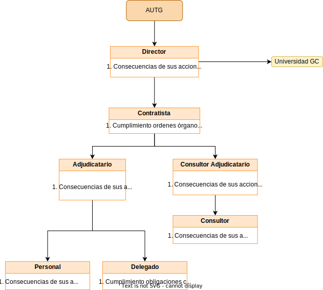

# Proyecto  

  

***Autores***:  
Ayoub Fehri Boulaadas  
Cristian Gil García.  
Pedro Sánchez Fernández.  
Sarai Besada Pino.  

## Hoja de revision

| ***Fecha*** | ***Version*** | ***Descripcion*** | ***Autor*** |
| --- | --- | --- | --- |
| 29/11/2022 | 1.0 | Proyecto para el desarrollo de un software de un sistema de informacion interactivo al viajero del transporte público regular de viajeros para la isla de Gran Canaria (Portal web de servicios) mediante procedimiento abierto | FehriGilFernandezBesada |  
## Indice

 

## Introduccion
En el siguiente documento se especifica los procesos llevados a cabo para el desarrollo de un proyecto software centrado en la implementación de un sistema de información y un portal web para una aplicación sobre el transporte público regular de viajeros para la isla de Gran Canaria.  
Además, se aporta información de la Autoridad de Transporte Público de Gran Canaria para facilitar el diseño del portal y sus funcionalidades.Por otra parte, se añaden los requisitos, diagramas, casos de uso e información necesaria para la implementación de todas las partes de la aplicación.

 

## Información del dominio del problema.  
### Organigrama
  

 

### Glosario de términos.
