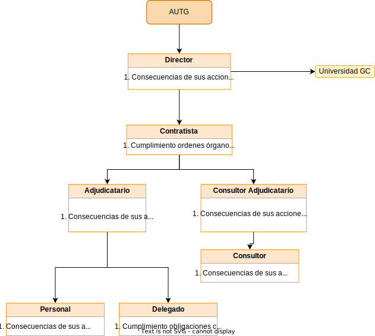

# Proyecto  

  

***Autores***:  
Ayoub Fehri Boulaadas  
Cristian Gil García.  
Pedro Sánchez Fernández.  
Sarai Besada Pino.  

## Hoja de revision

| ***Fecha*** | ***Version*** | ***Descripcion*** | ***Autor*** |
| ----------- | --- | --- | --- |
| 29/11/2022 | 1.0 | Proyecto para el desarrollo de un software de un sistema de informacion interactivo al viajero del transporte público regular de viajeros para la isla de Gran Canaria (Portal web de servicios) mediante procedimiento abierto | FehriGilFernandezBesada |  

 

## Introducción
En el siguiente documento se especifica los procesos llevados a cabo para el desarrollo de un proyecto software centrado en la implementación de un sistema de información y un portal web para una aplicación sobre el transporte público regular de viajeros para la isla de Gran Canaria.  
Además, se aporta información de la Autoridad de Transporte Público de Gran Canaria para facilitar el diseño del portal y sus funcionalidades.Por otra parte, se añaden los requisitos, diagramas, casos de uso e información necesaria para la implementación de todas las partes de la aplicación.

 

### Organigrama
  

## Glosario de términos

| ***Fecha*** | ***Versión*** | ***Descripción*** | ***Autor*** |
| --- | --- | --- | --- |
| 29/11/2022 | 1.0 | Diccionario de palabras técnicas que permite disponer de toda la información que pueda crear dudas sobre el proyecto en orden alfabético.| FehriGilFernandezBesada |  

| ***Fecha*** | ***Versión*** | ***Término*** |***Descripción*** |***Autor*** |
| --- | --- | --- | --- | --- |
| 29/11/2022 | 1.0 | Alarma | Notificación acerca de los cortes en carreteras, colapso tras algún evento o el retraso de un transporte siendo un usuario registrado. | FehriGilFernandezBesada |  
| 02/12/2022 | 1.0 | Operador de transporte | El conductor de cada medio de transporte. | FehriGilFernandezBesada |  
| 03/12/2022 | 1.0 | Operador adjudicatario | Los revisores y/o personal de asistencia que añaden información en el vehículo. | FehriGilFernandezBesada |  
| 03/12/2022 | 1.0 | Eventos | Monumentos, ocio, competencias deportivas, acontecimientos culturales autonónimos y nacionales. | FehriGilFernandezBesada |   
| 03/12/2022 | 1.0 | Medios de transporte | Atobuses, taxis, barcos y carros tirados por caballos. | FehriGilFernandezBesada |   
| 03/12/2022 | 1.0 | Tiempo de saltos | El tiempo que una incidencia hace que se retrase nuestro medio de transporte,el retrasado generado. | FehriGilFernandezBesada |   
| 03/12/2022 | 1.0 | Medio magnético | Un registro en un disco duro. | FehriGilFernandezBesada |   

# Necesidades del negocio.
## Objetivos del negocio
## Tareas.

# Requisitos del sistema a desarrollar.
## Requisitos del portal (A1)
## Requisitos del sistema de informacion (A2)
## Requisitos del sistema del sistema de monitorizacion de la explotacion del transporte (SMET)

| ***Requisito*** | ***Descripcion*** | ***Tipo*** |
|---|---|---|
| Mostrar sobre la cartografia en pantalla la actividad de los peradores |Se debe mostrar en pantalla (que a su vez muestra un mapa), la actividad de los operadores en tiempo real, teniendo la capacidad de registrar situaciones puntuales (fotos de estado) y periodos contínuos de tiempo (películas de estado). | Requisito funcional |  
| Visualizar las alarmas de los distintos proyectos de la autoridad | Se deben mostrar las alarmas (notificaciones) de los diversos proyectos de la autoridad de transporte (proyecto de monitorización y venta) que contenga información del sistema de ventas, gestión del título único del transporte (gestión de billetes únicos y su información que no permita la generación de dos iguales), información de adelanto o atraso del paso por parada, el estado de los sistemas (líneas no disponibles o buses fuera de servicio) y otros que se quieran integrar. | Requisito funcional |  
| Recibir avisos. | Se debe permitir definir eventos con base en variables y con unas condiciones que permitan generar avisos. | Requisito funcional |  
| Examinar el estado de la explotación en tiempo real. | Se debe poder examinar el estado de la explotación en tiempo real para el/los operador/es que prefiera el usuario. | Requisito funcional |  
| Visualización y monitorización del sistema | Se debe poder realizar la visualización y monitorización del sistema  en base a los datos que se reciban. Y también, desde los datos que puedan estar almacenados previamente, y que podrían enviarse al sistema para ser visualizados a posteriori, especificando un rango de fecha, hora, operador y tiempo de salto. Debe ser posible redefinir todas las notificaciones y validar los eventos recibidos y procesados. | Requisito funcional |  
| Claridad en contraste de la información. |En particular el sistema debe poner de manifiesto de modo claro y sin complejidad el nivel de cumplimiento de lo planificado respecto a lo realizado.   | Requisito no funcional |  
| Visualización de alarmas (notificaciones) simultáneas |Las alarmas (notificaciones) deben ser simultáneas en los distintos proyectos y se deben manifestar mediante avisos acústicos, visuales y mediante notificaciones a móviles aparte de otras a considerar. | Requisito no funcional |  