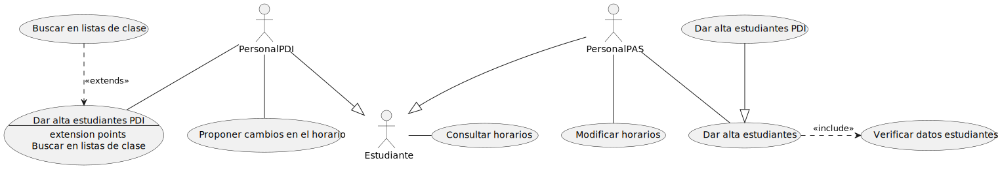
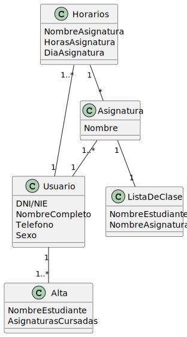
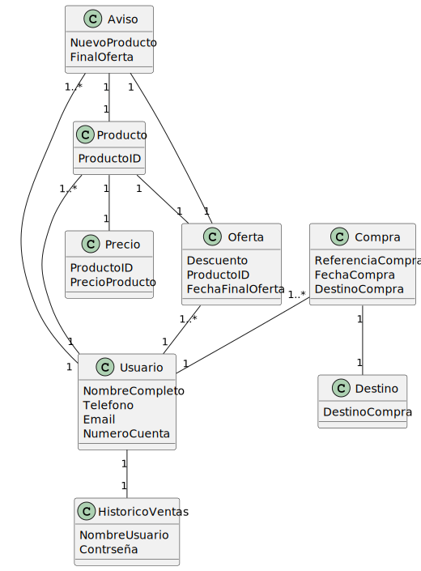

# Horarios
En una universidad, el personal del PDI, el personal del PAS y los estudiantes pueden consultar horarios. Por su parte, el personal del PAS puede modificar horarios y dar de alta estudiantes. El personal de PDI puede proponer cambios en los horarios y dar de alta estudiantes. La funcionalidad de dar de alta estudiantes del PAS realiza una verificación de los datos del estudiante. Sin embargo, la funcionalidad de dar de alta estudiantes del PDI, además de verificar los datos también permite de forma excepcional realizar la búsqueda en las listas de clase de sus asignaturas.

## Diagrama de Horarios

## Digrama entidad relación de horarios

## Tablas de casos de uso de Horarios.

| ***UC-01*** |  |
| --- | --- |
| ***Nombre:***  | Proponer cambios en el horario. |
| ***Autor:***  | Fehri Gil Fernandez Besada |
| ***Fecha:***  | 30/09/22 |
| ***Descripcion:*** |   El personal PDI puede proponer cambios en el horario. |
| ***Relaciones*** | INF-01,INF-03 |
| ***Actores:***  |    PersonalPDI. |
| ***Precondicion:*** |     El personal PDI debe estar logueado. |
| ***Flujo Normal:***  |    1. El personal PDI debe pulsar un boton para modificar el horario.   2. El actor rellena un formulario con los cambios realizados.   3. El actor pulsa un botón para confirmar los cambios. |
| ***Flujo Alternativo:*** |    1. Si al confirmar no se actualiza el horario vuelve a mostrar el formulario.   2. Si no se rellena el formulario se mostrará un mensaje de error. |
| ***Poscondiciones*** |     |

| ***UC-02*** |  |
| --- | --- |
| ***Nombre:***  | Consultar horarios. |
| ***Autor:***  | Fehri Gil Fernandez Besada |
| ***Fecha:***  | 30/09/22 |
| ***Descripcion:*** |   El usuario puede comprobar el horario correspondiente |
| ***Relaciones*** | INF-01 |
| ***Actores:***  |    Estudiantes. |
| ***Precondicion:*** |     El estudiante debe de tener sus datos personales en la universidad y por tanto estar dado de alta. |
| ***Flujo Normal:***  |    1. El estudiante accede a la pestaña de horario.   2. El estudiante debe de elegir el dia y el mes.   3. El actor pulsa un botón para el envio del formulario.   4. El sistema comprueba que los datos introducidos.   5. Visualizacion del horario. |
|***Flujo Alternativo:*** |   4.A.- El sistema comprueba que los datos introducidos son correctos, en caso de que en el dia no haya ninguna clase se enviara un mensaje de error. 4.B.- El sistema comprueba que los datos introducidos son correctos, en caso de que los datos no lo sean, se avisara al usuario que los corrija.|
|***Postcondiciones*** |    |
 

| ***UC-03*** |  |
| --- | --- |
| ***Nombre:***  | Modificar horarios. |
| ***Autor:***  | FehriGilFernandezBesada |
| ***Fecha:***  | 30/09/22 |
| ***Descripcion:*** |   El personal PAS puede modificar los horarios. |
| ***Actores:***  |    PersonalPAS. |
| ***Precondicion:*** |    El personal PAS debe estar logueado como PAS. |
| ***Relaciones*** | INF-03 |
| ***Flujo Normal:*** |    1. El personal PAS debe pulsar un boton para modificar el horario.   2. El actor rellena un formulario con cajas de texto para los nuevos cambios realizados.   3. El actor pulsa un botón para confirmar los cambios. |
|***Flujo Alternativo:*** |   2A. El sistema comprueba los datos del formulario y si no son correctos pide corrección |
| ***Poscondiciones :*** |   El horario se ha modificado |

| ***UC-04*** |  |
| --- | --- |
| ***Nombre:***  | Dar alta estudiantes (PDI) |
| ***Autor:***  | FehriGilFernandezBesada |
| ***Fecha:***  | 30/09/22 |
| ***Descripcion:*** |   El personal PDI puede dar de alta a estudiantes. |
| ***Relaciones*** | UC-05,UC-06 |
| ***Actores:***  |    PersonalPDI. |
| ***Precondicion:*** |    El personal PDI debe estar logueado como PDI. |
| ***Flujo Normal:*** |    1. El personal PDI debe pulsar un boton para elegir la opcion de dar alta a un estudiante.   2. El actor rellena un formulario con cajas de texto para los datos del estudiante que se va a dar de alta.   3. El actor pulsa un botón para confirmar los cambios.   4. Los datos de los estudiantes deberan ser verificados por el sistema. |
|***Flujo Alternativo:*** |   2A. Si en los datos existen correlacion con un alumno el personal puede buscar en las listas de clase.   2B. El sistema comprueba los datos del formulario y si no son correctos pide corrección. |
| ***Poscondiciones :*** |   El estudiante ha sido dado de alta. |
 

| ***UC-05*** |  |
| --- | --- |
| ***Nombre:***  | Buscar en listas de clase. |
| ***Autor:***  | FehriGilFernandezBesada |
| ***Fecha:***  | 30/09/22 |
| ***Descripcion:*** |   El personal PDI de manera opcional puede buscar en las listas de clase. |
| ***Relaciones*** | UC-04 |
| ***Actores:***  |    PersonalPDI. |
| ***Precondicion:*** |    El personal debe estar logueado como PDI |
| ***Flujo Normal:*** |    1. El personal PDI debe dar de alta a un alumno.   2. El personal PDI puede utilizar la opcion en las listas si existen correlaciones con los datos de los alumnos   3. El actor pulsa un botón para confirmar los cambios. |
|***Flujo Alternativo:*** |   2A. El sistema comprueba los datos del formulario y si no son correctos pide corrección |
| ***Poscondiciones :*** |    |
 

| ***UC-06*** |  |
| --- | --- |
| ***Nombre:***  | Dar alta estudiantes |
| ***Autor:***  | FehriGilFernandezBesada |
| ***Fecha:***  | 30/09/22 |
| ***Descripcion:*** |   El personal PAS puede dar de alta a estudiantes. |
| ***Relaciones*** | UC-04 |
| ***Actores:***  |    PersonalPAS. |
| ***Precondicion:*** |    El personal PAS debe estar logueado como PAS. |
| ***Flujo Normal:*** |    1. El personal PAS debe pulsar un boton para elegir la opcion de dar alta a un estudiante.   2. El actor rellena un formulario con cajas de texto para los datos del estudiante que se va a dar de alta.   3. El actor pulsa un botón para confirmar los cambios.   4. Los datos de los estudiantes deberan ser verificados por el sistema. |
|***Flujo Alternativo:*** |   4A. El sistema verifica los datos y comprueba que son erroneos por lo que se muestra un mensaje al personal PAS. |
| ***Poscondiciones :*** |   El estudiante ha sido dado de alta. |
 

## Tablas de los requisitos de información de Horarios

| ***INF-01*** | Usuarios del sistema. |
| --- | --- |
| ***Version:***  | Septiembre-2022 |
| ***Autor:***  | FehriGilFernandezBesada |
| ***Referencias:*** |   Estudiante, PersonalPDI, personalPAS. |
| ***Fuentes:***  |    Horarios.   |
| ***Descripción*** |   El sistema deberá almacenar los datos correspondientes a todos los usuarios del sistema. |
| ***Datos especificos:*** |  1. DNI/NIE: Cadena de máximo 10 caracteres.   2. Nombre completo: Cadena de máximo 30 caracteres.   3.Teléfono de contacto: Entero positivo.   4. Sexo: Un carácter "F" o "M"    |
| ***Importancia:*** |   Muy importante. |
| ***Estado:*** |   Aceptado. |
| ***Comentarios:*** |   Los datos de los usuarios del sistema son imprescindibles en el correcto funcionamiento del sistema.|
 

| ***INF-02*** | Información sobre altas de los estudiantes |
| --- | --- |
| ***Version:***  | Septiembre-2022 |
| ***Autor:***  | FehriGilFernandezBesada |
| ***Referencias:*** |   Dar alta estudiantes. |
| ***Fuentes:***  |    Horarios.   |
| ***Descripción*** |   El sistema deberá almacenar los datos necesarios para dar de alta a los estudiantes. |
| ***Datos especificos:*** |  1. Nombre completo del estudiante: Cadena.   5. Asignaturas cursadas del estudiante: Cadena.     |
| ***Importancia:*** |   Muy importante. |
| ***Estado:*** |   Aceptado. |
| ***Comentarios:*** |   |
 

| ***INF-03*** | Información sobre horarios. |
| --- | --- |
| ***Version:***  | Septiembre-2022 |
| ***Autor:***  | FehriGilFernandezBesada |
| ***Referencias:*** |   Consultar horarios, Modificar horarios, Proponer cambios en los horarios. |
| ***Fuentes:***  |    Horarios. |
| ***Descripción*** |   El sistema deberá almacenar los datos correspondientes a los horarios de las distintas asignaturas. |
| ***Datos especificos:*** |  1. Nombre de las Asignaturas: Cadena.   2. Rango de horas en la que se imparte cada asignatura: Cadena con la siguiente información, hh-mm/hh-mm   3.Día en el que se imparte la asignatura: Cadena  |
| ***Importancia:*** |   Muy importante. |
| ***Estado:*** |   Aceptado. |
| ***Comentarios:*** |   El horario es imprescindible para el correcto funcionamiento del sistema.|
 

| ***INF-04*** | Información sobre asignaturas. |
| --- | --- |
| ***Version:***  | Septiembre-2022 |
| ***Autor:***  | FehriGilFernandezBesada |
| ***Referencias:*** |   Consultar horarios, Modificar horarios, Proponer cambios en los horarios. |
| ***Fuentes:***  |    Horarios. |
| ***Descripción*** |   El sistema deberá almacenar los datos correspondientes a las distintas asignaturas. |
| ***Datos especificos:*** |  1. Nombre: Cadena.    |
| ***Importancia:*** |   Muy importante. |
| ***Estado:*** |   Aceptado. |
| ***Comentarios:*** |   Las asignaturas son imprescindible para el correcto funcionamiento del sistema.|

| ***INF-05*** | Información sobre lista de clase. |
| --- | --- |
| ***Version:***  | Septiembre-2022 |
| ***Autor:***  | FehriGilFernandezBesada |
| ***Referencias:*** |   Consultar horarios, Modificar horarios, Proponer cambios en los horarios. |
| ***Fuentes:***  |    Horarios. |
| ***Descripción*** |   El sistema deberá almacenar los datos correspondientes a las listas de clases. |
| ***Datos especificos:*** |  1. Nombre de la Asignatura: Cadena.    2. Nombre de los estudiantes: cadena. |
| ***Importancia:*** |   Muy importante. |
| ***Estado:*** |   Aceptado. |
| ***Comentarios:*** |   |

# Sistema de compras
En un sistema de compra, existen cuatro tipos de usuarios: comprador, vendedor, proveedor y administrador. Los compradores pueden agregar productos, consultar precios, finalizar la compra y consultar ofertas. Agregar productos implica marcar esos productos como bloqueados. Los vendedores también pueden consultar ofertas y consultar precios. Los proveedores pueden consultar precios, avisar de nuevos productos y consultar ofertas. Avisar de nuevos productos, de forma excepcional, realiza la incorporación de una oferta. Los proveedores también tienen una funcionalidad para avisar del fin de una oferta. Cuando se avisa del fin de una oferta, se ejecuta la funcionalidad de eliminar la oferta. Ambas funcionalidades de avisar del proveedor tienen en común que se encarga de enviar una notificación. Los administradores pueden consultar precios, consultar ofertas y eliminar productos. La funcionalidad de consultar precios incluye una funcionalidad de buscar productos que es similar a la funcionalidad de consultar productos de los compradores. Sin embargo, la funcionalidad de consultar productos añade una funcionalidad para verificar la disponibilidad. Para realizar una venta, un comprador y un vendedor participan de forma conjunta. En dicha operación, se lleva a cabo el acuerdo de un precio; excepcionalmente, durante la realización de la venta, se consultará el histórico de ventas.

## Diagrama de Sistema de compras.

## Diagrama de entidad relación de Sistema de compras

## Tabla de casos de uso de Sistema de compras

| ***UC-01*** |  |
| --- | --- |
| ***Nombre:***  | Finalizar compra |
| ***Autor:***  | FehriGilFernandezBesada |
| ***Fecha:***  | 30/09/22 |
| ***Descripcion:*** |   El comprador puede finalizar una compra. |
| ***Relaciones*** | INF-02 |
| ***Actores:***  |    Comprador |
| ***Precondicion:*** |    El comprador debera haber agredado productos |
| ***Flujo Normal:*** |    1. El comprador debera introducir la opcion de finalizar la compra.   2. Se procesan los datos de los artículos selecionados y se pasa a las opciones de pago   3. Se rellenan los formularios de las opciones de pago.   4. Se comprueba la informacion de pago.   5. Se realiza la transaccion.  |
|***Flujo Alternativo:*** |   4A. La informacion de los datos de pago son erroneos y se informa al comprador |
| ***Poscondiciones :*** |   Se guarda en el sistema el registro de la compra. |
 

| ***UC-02*** |  |
| --- | --- |
| ***Nombre:***  | Agregar productos. |
| ***Autor:***  | FehriGilFernandezBesada |
| ***Fecha:***  | 30/09/22 |
| ***Descripcion:*** |   El comprador puede agregar productos de su compra. |
| ***Relaciones*** | INF-04,INF-06 |
| ***Actores:***  |    Comprador. |
| ***Precondicion:*** |    Los productos deben mostrarse disponibles. |
| ***Flujo Normal:*** |    1. El comprador puede seleccionar un producto clickando sobre el.   2. El producto se agrega a la cesta de productos de la compra.   3. El producto se bloquea. |
|***Flujo Alternativo:*** |    |
| ***Poscondiciones :*** |   El producto ha sido agregado. |
 

| ***UC-03*** |  |
| --- | --- |
| ***Nombre:***  | Consultar productos. |
| ***Autor:***  | FehriGilFernandezBesada |
| ***Fecha:***  | 30/09/22 |
| ***Descripcion:*** |   El comprador puede consultar algunos productos |
| ***Relaciones*** | UC-04, UC-06 |
| ***Actores:***  |    Comprador. |
| ***Precondicion:*** |    El producto tiene que estar disponible. |
| ***Flujo Normal:*** |    1. Los actores deben introducir la id o palabra clave en el motor de busqueda.   2. El sistema muestra informacin relacionada con los datos introducidos en el buscador.   2. El sistema comprueba la disponibilad del producto   3. El sistema ofrece informacion del producto consultado |
|***Flujo Alternativo:*** |   3A. Si el producto no esta disponible, se muestra un mensaje advirtiendo de esto el comprador. |
| ***Poscondiciones :*** |    |
 

| ***UC-04*** |  |
| --- | --- |
| ***Nombre:***  | Buscar productos. |
| ***Autor:***  | FehriGilFernandezBesada |
| ***Fecha:***  | 30/09/22 |
| ***Descripcion:*** |   El comprador puede buscar productos y consultar su información. |
| ***Relaciones*** | INF-04 |
| ***Actores:***  |    Comprador, Abstracto. |
| ***Precondicion:*** |    El producto debe existir en el sistema. |
| ***Flujo Normal:*** |    1. Los actores deben introducir la id o palabra clave en el motor de busqueda.   2. El sistema muestra información relacionada con los datos introducidos en el buscador. |
|***Flujo Alternativo:*** |   2A. El sistema no encuentra correlaciones con los datos introducidos e informa al usuario |
| ***Poscondiciones :*** |   El sistema ha mostrado un mensaje al usuario. |
 

| ***UC-05*** |  |
| --- | --- |
| ***Nombre:***  | Realizar venta. |
| ***Autor:***  | FehriGilFernandezBesada |
| ***Fecha:***  | 30/09/22 |
<<<<<<< HEAD
| ***Descripcion:*** |   El comprador puede realizar la compra tras hablar . |
| ***Actores:***  |    Comprador, Vendedor. |
| ***Precondicion:*** |    Vendedor y comprador deben haber acordado un precio. |
| ***Flujo Normal:*** |    1. El comprador debe tener sus productos agregados.   2. El vendedor y el comprador acuerdan el precio.    3. Llegan a un acuerdo para poder finalizar la compra. |
|***Flujo Alternativo:*** |   3A. Si el comprador no acepta el precio no se llegaria a realizar la compra. |
| ***Poscondiciones :*** |    |
 
=======
| ***Autor:***  | FehriGilFernandezBesada |
| ***Fecha:***  | 30/09/22 |
| ***Descripcion:*** |   El comprador y el vendedor pueden realizar una venta simultaneamente. |
| ***Relaciones*** | UC-08  |
| ***Actores:***  |    Comprador, Vendedor. |
| ***Precondicion:*** |    El comprador y el vendedor necesitan realizar esta funcion simultaneamente. |
| ***Flujo Normal:*** |    1. Los actores deben introducir la id o palabra clave en el motor de busqueda.   2. El sistema muestra informacin relacionada con los datos introducidos en el buscador.  3. Ambos actores deben acordar un precio.   4. Se realiza la compra y se registra en el sistema   |
|***Flujo Alternativo:*** |   2A. El sistema no encuentra correlaciones con los datos introducidos e informa al usuario |
| ***Poscondiciones :*** |   El sistema ha mostrado un mensaje al usuario.  |

 

| ***UC-06*** |  |
| --- | --- |
| ***Nombre:***  | Verificar disponibilidad |
| ***Autor:***  | FehriGilFernandezBesada |
| ***Fecha:***  | 30/09/22 |
| ***Descripcion:*** |   El sistema comprueba la disponibilidad de los productos consultados. |
| ***Relaciones*** | UC-03 |
| ***Actores:***  |    Comprador. |
| ***Precondicion:*** |    El comprador consulta productos. |
| ***Flujo Normal:*** |    1. El comprador realiza la busqueda del producto a consultar.   2. El sistema comprueba la disponibilad del producto   3. El sistema ofrece informacion del producto consultado |
|***Flujo Alternativo:*** |   3A. Si el producto no esta disponible, se muestra un mensaje advirtiendo de esto el comprador. |
| ***Poscondiciones :*** |    |
 

| ***UC-07*** |  |
| --- | --- |
| ***Nombre:***  | Marcar productos bloqueados |
| ***Autor:***  | FehriGilFernandezBesada |
| ***Fecha:***  | 30/09/22 |
| ***Descripcion:*** |   El sistema comprueba la disponibilidad de los productos consultados. |
| ***Relaciones*** | UC-02, UC-03 |
| ***Actores:***  |    Comprador. |
| ***Precondicion:*** |    Un producto debe estar disponible |
| ***Flujo Normal:*** |    1. El comprador puede seleccionar un producto clickando sobre el.   2. El producto se agrega a la cesta de productos de la compra.   3. El producto se bloquea. |
|***Flujo Alternativo:*** |   2A. El producto no esta disponible e informa al comprador. |
| ***Poscondiciones :*** |   El producto ha sido bloqueado. |

 

| ***UC-08*** |  |
| --- | --- |
| ***Nombre:***  | Acordar un precio |
| ***Autor:***  | FehriGilFernandezBesada |
| ***Fecha:***  | 30/09/22 |
| ***Descripcion:*** |   Vendedor y comprador acuerdan un precio para un producto |
| ***Relaciones*** | UC-05, UC-06 |
| ***Actores:***  |    Comprador, Vendedor. |
| ***Precondicion:*** |    Un producto debe estar disponible |
| ***Flujo Normal:*** |    1. El vendedor establece un precio inicial.   2. El comprador acepta el precio. |
|***Flujo Alternativo:*** |   2A. El comprador no acepta el precio y se debe establecer otro o finalizar compra.   3. Consultar historico de ventas. |
| ***Poscondiciones :*** |    |

 

| ***UC-09*** |  |
| --- | --- |
| ***Nombre:***  | Consultar historico de ventas |
| ***Autor:***  | FehriGilFernandezBesada |
| ***Fecha:***  | 30/09/22 |
| ***Descripcion:*** |   Cuando se acuerda un precio, opcionalmente se puede consultar un historico |
| ***Relaciones*** | UC-05, UC-06 |
| ***Actores:***  |    Comprador, Vendedor. |
| ***Precondicion:*** |    Un producto debe estar disponible |
| ***Flujo Normal:*** |    1. El vendedor establece un precio inicial.   2. El comprador acepta el precio. |
|***Flujo Alternativo:*** |   2A. El comprador no acepta el precio y se debe establecer otro o finalizar compra.   3. Consultar historico de ventas. |
| ***Poscondiciones :*** |    |

 

| ***UC-10*** |  |
| --- | --- |
| ***Nombre:***  | Consultar precios |
| ***Autor:***  | FehriGilFernandezBesada |
| ***Fecha:***  | 30/09/22 |
| ***Descripcion:*** |   Se puede consultar el precio de un producto en venta |
| ***Relaciones*** | UC-04|
| ***Actores:***  |    Abstracto. |
| ***Precondicion:*** |    Un producto debe estar disponible |
| ***Flujo Normal:*** |    1. Se debe buscar un producto.   2. Se muestra en  pantalla el precio del producto. |
|***Flujo Alternativo:*** |   2A. El producto no existe o no se encuentra disponible y se muestra el mensaje en pantalla. |
| ***Poscondiciones :*** |    |

 

| ***UC-11*** |  |
| --- | --- |
| ***Nombre:***  | Consultar ofertas. |
| ***Autor:***  | FehriGilFernandezBesada |
| ***Fecha:***  | 30/09/22 |
| ***Descripcion:*** |   Se muestran las ofertas disponibles en el momento de la consulta. |
| ***Relaciones*** |  |
| ***Actores:***  |    Abstracto. |
| ***Precondicion:*** |     |
| ***Flujo Normal:*** |    1. El actor pide información sobre ofertas actuales.   2. El sistema agrupa información sobre las ofertas disponibles   3. El sistema lista todas las ofertas en pantalla |
|***Flujo Alternativo:*** |   3A. No existen ofertas disponibles y se muestra el mensaje en pantalla. |
| ***Poscondiciones :*** |    |

 

| ***UC-12*** |  |
| --- | --- |
| ***Nombre:***  | Eliminar producto |
| ***Autor:***  | FehriGilFernandezBesada |
| ***Fecha:***  | 30/09/22 |
| ***Descripcion:*** |   El administrador puede eliminar un producto existente del sistema. |
| ***Relaciones*** |  |
| ***Actores:***  |    Administrador. |
| ***Precondicion:*** |    El producto debe exitir en el sistema. |
| ***Flujo Normal:*** |    1. El administrador escoge el producto a eliminar.   2. El administrador pulsa sobre la opción "eliminar producto"   3. El administrador confirma que quiere eliminar el producto. |
|***Flujo Alternativo:*** |   3A. El administrador no confirma la eliminación y el producto no se elimina. |
| ***Poscondiciones :*** |   Se ha eliminado el producto. |

 

| ***UC-13*** |  |
| --- | --- |
| ***Nombre:***  | Avisar |
| ***Autor:***  | FehriGilFernandezBesada |
| ***Fecha:***  | 30/09/22 |
| ***Descripcion:*** |   El proovedor puede realizar avisos con notificaciones. |
| ***Relaciones*** | UC-14, UC-15, UC-16, UC-17 |
| ***Actores:***  |    Proveedor. |
| ***Precondicion:*** |     |
| ***Flujo Normal:*** |    1. El proveedor debe acceder a la seccion de notificaciones.   2. El proveedor debe redactar el mensaje que quiere enviar.   3. El proveedor debe pulsar "enviar notificacion" |
|***Flujo Alternativo:*** |    |
| ***Poscondiciones :*** |    |

 

| ***UC-14*** |  |
| --- | --- |
| ***Nombre:***  | Enviar notificacion |
| ***Autor:***  | FehriGilFernandezBesada |
| ***Fecha:***  | 30/09/22 |
| ***Descripcion:*** |   El proveedor puede enviar una notificación. |
| ***Relaciones*** | UC-13 |
| ***Actores:***  |    Proveedor. |
| ***Precondicion:*** |     |
| ***Flujo Normal:*** |    1. El provedor redacta un mensaje.   2. El proveedor pulsa "enviar notificación" |
|***Flujo Alternativo:*** |   3A. El administrador no confirma la eliminación y el producto no se elimina. |
| ***Poscondiciones :*** |    |

 

| ***UC-15*** |  |
| --- | --- |
| ***Nombre:***  | Avisar fin de oferta |
| ***Autor:***  | FehriGilFernandezBesada |
| ***Fecha:***  | 30/09/22 |
| ***Descripcion:*** |   El proveedor envía una notificación avisando del fin de una oferta. |
| ***Relaciones*** | UC-13, UC-16 |
| ***Actores:***  |    Proveedor. |
| ***Precondicion:*** |     |
| ***Flujo Normal:*** |   1. El proveedor debe acceder a la seccion de notificaciones.   2. El provedor redacta un mensaje.   2. El proveedor pulsa "enviar notificación".   3. El proveedor elimina la oferta. |
|***Flujo Alternativo:*** |    |
| ***Poscondiciones :*** |    |

 

| ***UC-16*** |  |
| --- | --- |
| ***Nombre:***  | Eliminar oferta |
| ***Autor:***  | FehriGilFernandezBesada |
| ***Fecha:***  | 30/09/22 |
| ***Descripcion:*** |   El proveedor puede eliminar una oferta. |
| ***Relaciones*** | UC-13, UC-15 |
| ***Actores:***  |    Proveedor. |
| ***Precondicion:*** |   El proovedor debe avisar del fin de oferta. |
| ***Flujo Normal:*** |    1. El proveedor seleciona la oferta a eliminar.   2. El proveedor pulsa la opcion "eliminar oferta".   3. El proveedor confirma la eliminacion de la oferta |
|***Flujo Alternativo:*** |   3A. El proveedor no confirma la eliminación y la oferta no se elimina. |
| ***Poscondiciones :*** |   La oferta se ha eliminado. |

 

| ***UC-17*** |  |
| --- | --- |
| ***Nombre:***  | Avisar nuevos productos |
| ***Autor:***  | FehriGilFernandezBesada |
| ***Fecha:***  | 30/09/22 |
| ***Descripcion:*** |   El proveedor envía una notificacion informando de nuevos productos. |
| ***Relaciones*** | UC-13, UC-18 |
| ***Actores:***  |    Proveedor. |
| ***Precondicion:*** |     |
| ***Flujo Normal:*** |   1. El proveedor debe acceder a la seccion de notificaciones.   2. El provedor redacta un mensaje.   2. El proveedor pulsa "enviar notificación" |
|***Flujo Alternativo:*** |   3. Opcionalmente se puede realizar la incorporacion del producto |
| ***Poscondiciones :*** |    |

 

| ***UC-18*** |  |
| --- | --- |
| ***Nombre:***  | Realizar incorporacion |
| ***Autor:***  | FehriGilFernandezBesada |
| ***Fecha:***  | 30/09/22 |
| ***Descripcion:*** |   El proveedor incorpora un nuevo producto. |
| ***Relaciones*** | UC-13, UC-17 |
| ***Actores:***  |    Proveedor. |
| ***Precondicion:*** |    El proveedor avisa de la incorporacion del producto. |
| ***Flujo Normal:*** |   1. El proveedor selecciona el producto que quiere añadir.   2. El proveedor pulsa la opcion "incorporar producto". |
|***Flujo Alternativo:*** |   |
| ***Poscondiciones :*** |   La incorporacion se ha realizado y se ha guardado en el sistema. |

 

## Tablas de los requisitos de información de Sistema de compras.

| ***INF-01*** | Información sobre los usuarios del sistema.  |
| --- | --- |
| ***Version:***  | Septiembre-2022 |
| ***Autor:***  | FehriGilFernandezBesada |
| ***Referencias:*** |   Vendedor, Proveedor, Comprador, Administrador. |
| ***Fuentes:***  |     Sistema de Compras  |
| ***Descripción:*** |   El sistema deberá almacenar los datos sobre los diferentes roles   que ejerce el usuario del sistema. |
| ***Datos especificos:*** |     1. Nombre completo: Cadena de máximo 30 caracteres.   2.Teléfono de contacto: Cadena de máximo 10 caracteres.    3. Email: Cadena   Numero de cuenta bancaria: Entero postivo. |
| ***Importancia:*** |   Muy importante. |
| ***Estado:*** |   Aceptado. |
| ***Comentarios:*** |   Los datos de los usuarios son imprescindibles en el correcto funcionamiento del sistema.|

 ***INF-02*** | Información sobre compras.  |
| --- | --- |
| ***Version:***  | Septiembre-2022 |
| ***Autor:***  | FehriGilFernandezBesada |
| ***Referencias:*** |   Finalizar compra. |
| ***Fuentes:***  |     Sistema de Compras  |
| ***Descripción:*** |   El sistema deberá almacenar la información correspondiente a las compras realizadas por los compradores. |
| ***Datos especificos:*** |     1. Número de referencia de la compra: Entero positivo de 5 dígitos.   2.Fecha de realización de la compra: dd/mm/aaaa.    3. Destino del producto comprado: Cadena de un máximo de 30 caracteres. |
| ***Importancia:*** |   Muy importante. |
| ***Estado:*** |   Aceptado. |
| ***Comentarios:*** |   |

 ***INF-03*** | Información sobre las ofertas.  |
| --- | --- |
| ***Version:***  | Septiembre-2022 |
| ***Autor:***  | FehriGilFernandezBesada |
| ***Referencias:*** |   Consultar ofertas. |
| ***Fuentes:***  |     Sistema de Compras.  |
| ***Descripción:*** |   El sistema deberá almacenar la información correspondiente a las diferentes ofertas. |
| ***Datos especificos:*** |     1. Porcentaje de descuento: Cadena de 2 caracteres. Ejemplo: "%25".   2. Identificador del producto ofertado: Entero positivo de 5 digitos.   3. Fecha de finalización de la oferta: dd/mm/aaaa. |
| ***Importancia:*** |   Importante. |
| ***Estado:*** |   Aceptado. |
| ***Comentarios:*** |   Los productos ofertados deben estar presentes en el sistema junto a sus condiciones para que el comprador las pueda considerar. |
 

***INF-04*** | Información sobre productos.  |
| --- | --- |
| ***Version:***  | Septiembre-2022 |
| ***Autor:***  | FehriGilFernandezBesada |
| ***Referencias:*** |   Buscar producto, Agregar producto. |
| ***Fuentes:***  |     Sistema de Compras.  |
| ***Descripción:*** |   El sistema deberá almacenar la información correspondiente a los productos dsiponibles. |
| ***Datos especificos:*** |     1. Identificador del producto: entero de 3 dígitos. |
| ***Importancia:*** |   Muy importante. |
| ***Estado:*** |   Aceptado. |
| ***Comentarios:*** |   |

 

***INF-05*** | Información sobre precios.  |
| --- | --- |
| ***Version:***  | Septiembre-2022 |
| ***Autor:***  | FehriGilFernandezBesada |
| ***Referencias:*** |   Consultar precios. |
| ***Fuentes:***  |     Sistema de Compras.  |
| ***Descripción:*** |   El sistema deberá almacenar la información correspondiente a los precios. |
| ***Datos especificos:*** |     1. Identificador del producto: entero de 3 dígitos.   2.Precio en euros del producto: Número real. |
| ***Importancia:*** |   Muy importante. |
| ***Estado:*** |   Aceptado. |
| ***Comentarios:*** |   |
 

***INF-06*** | Información sobre avisos.  |
| --- | --- |
| ***Version:***  | Septiembre-2022 |
| ***Autor:***  | FehriGilFernandezBesada |
| ***Referencias:*** |   Avisar. |
| ***Fuentes:***  |     Sistema de Compras.  |
| ***Descripción:*** |   El sistema deberá avisar a los usuarios de los productos que vayan saliendo a la venta. |
| ***Datos especificos:*** |     1. Notificación mostrando todos los nuevos productos: Cadena de máximo 20 caracteres por producto.   2.Aviso de final de oferta: cadena |
| ***Importancia:*** |   Muy importante. |
| ***Estado:*** |   Aceptado. |
| ***Comentarios:*** |   |

 ***INF-07*** | Información sobre destinos.  |
| --- | --- |
| ***Version:***  | Septiembre-2022 |
| ***Autor:***  | FehriGilFernandezBesada |
| ***Referencias:*** |   Finalizar compra. |
| ***Fuentes:***  |     Sistema de Compras  |
| ***Descripción:*** |   El sistema deberá almacenar la información correspondiente al destino de cada una de las compras. |
| ***Datos especificos:*** |    1. Destino del producto comprado: Cadena de un máximo de 30 caracteres. |
| ***Importancia:*** |   Muy importante. |
| ***Estado:*** |   Aceptado. |
| ***Comentarios:*** |   |

***INF-08*** | Información sobre el histórico de ventas.  |
| --- | --- |
| ***Version:***  | Septiembre-2022 |
| ***Autor:***  | FehriGilFernandezBesada |
| ***Referencias:*** |   Consultar histórico ventas. |
| ***Fuentes:***  |     Sistema de Compras  |
| ***Descripción:*** |   El sistema deberá almacenar la información correspondiente al histórico de ventas. |
| ***Datos especificos:*** |     1.Nombre del usuario.   2. Contraseña: cadena. |
| ***Importancia:*** |   Muy importante. |
| ***Estado:*** |   Aceptado. |
| ***Comentarios:*** |   |
