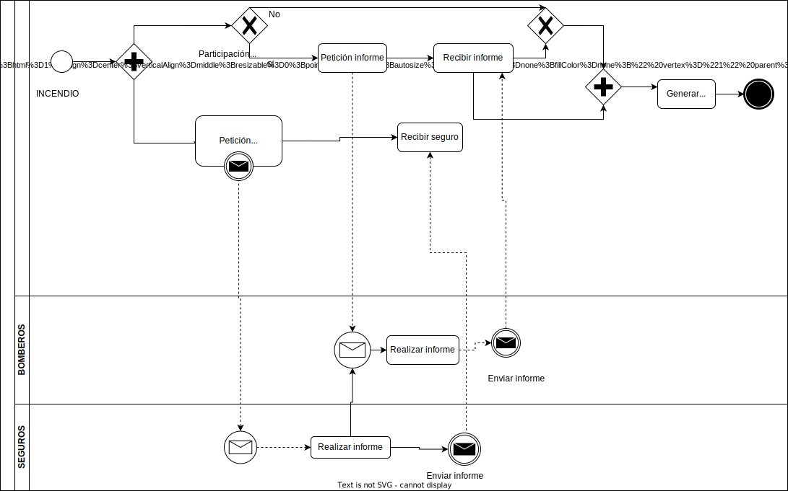

# Incendio
Después de un incendio, por un lado se necesita obtener información de nuestra compañía de seguro. Por otro lado, es posible que necesitemos información adicional del departamento de bomberos, pero solo si los bomberos participaron durante el apagado del incendio. Cuando se tenga toda la información, se necesita escribir un informe consolidado.

# Aprobación de fondos
1.Un proceso cliente envía una petición para que se realice una solicitud y aprobación de fondos

2.Se solicita y recibe la información de la solicitud de un empleado

3.Se solicita y recibe la aprobación de la solicitud de un gerente

4.Si la solicitud del empleado es rechazada se vuelve al paso #2

5.Si se aprueba la solicitud, se solicita y recibe información contable al director del área

6.Se solicita y recibe la revisión del departamento de finanzas. Este departamento puede:

    a.Aprobar

    b.Rechazar basados en la información de la solicitud del empleado

    c.Rechazar basados en la información contable proporcionada por el director

7.Si el departamento de finanzas rechazó basado en la solicitud del empleado, se debe volver al paso #2

8.Si el departamento de finanza rechazó basado en la información contable, se debe volver al paso #5

9.Si el departamento de finanzas aprobó, el proceso finaliza enviando un mensaje al proceso cliente.

# Información revisada
Un empleado envía una información para ser revisada. A un gerente se le envía la información para su revisión, quien tiene la potestad de aprobarla o rechazarla. Si se aprueba, el empleado recibe una notificación y el proceso culmina. De lo contrario al empleado se le envía la información para su corrección. El empleado procede a realizar los cambios y a enviar la información de vuelta. Luego se envía una notificación al gerente y el proceso culmina.

